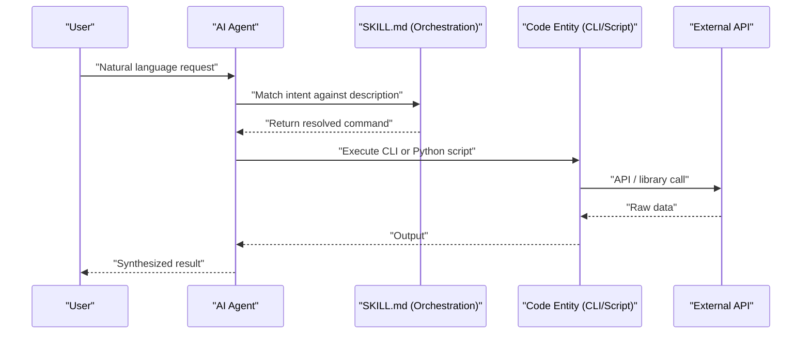

# Skill Orchestration Layer Flow

Based on the Overview wiki page and the Skill Architecture wiki (page 1.2), the **Skill Orchestration Layer** sits between "Natural Language Space" and "Code Entity Space" and is governed by `SKILL.md` & YAML metadata. Its workflow contains these major steps:

---

### 1. Intent Matching
The AI agent reads the `description` field in `SKILL.md` frontmatter to match the user's natural language request to the correct skill (e.g., `"Find EGFR inhibitors"` → `database-lookup`). [1](#0-0) 

---

### 2. Command Resolution
The matched `SKILL.md` manifest returns the specific CLI command or API call to use (e.g., `pz paper <id> --markdown`), effectively translating intent into a concrete code entity. [2](#0-1) 

---

### 3. Tool Execution
The agent invokes the resolved Python script or CLI tool within the execution environment (using `uv`/Python 3.13+). The tool then makes the actual external API call or runs the computation. [3](#0-2) 

---

### 4. Result Propagation
The CLI/script returns raw output back to the agent, which then synthesizes and presents the result to the user.

---

The full flow is illustrated in the sequence diagram from wiki page 1.2:



The orchestration layer's core job is steps 2 and 3 — bridging the gap between what the user *says* and what the agent *executes*, using the `SKILL.md` manifest as the routing and instruction layer. [4](#0-3)

### Citations

**File:** scientific-skills/paperzilla/SKILL.md (L1-7)
```markdown
---
name: paperzilla
description: Chat with your agent about projects, recommendations, and canonical papers in Paperzilla. Use when users ask for recent project recommendations, canonical paper details, markdown-based summaries, recommendation feedback, feed export, or Atom feed URLs.
license: MIT
metadata:
  skill-author: "Paperzilla Inc"
---
```

# Orchestration Architecture
* https://deepwiki.com/K-Dense-AI/scientific-agent-skills/1.3-real-world-workflow-examples#research-workflow-data-flow