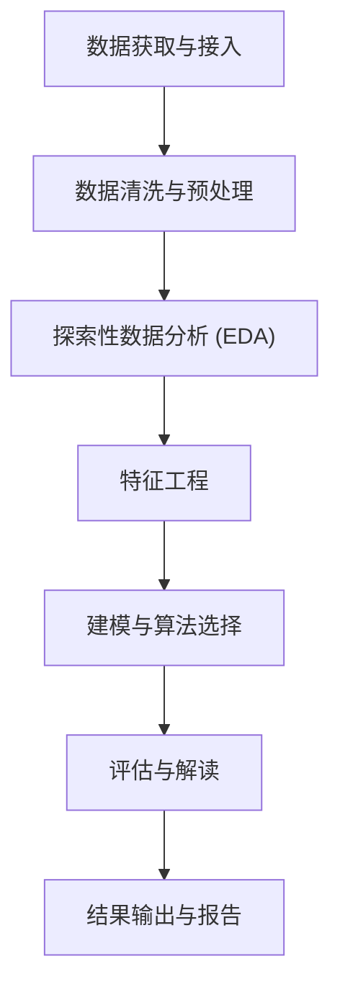

# 完整数据分析工作流程

---

## 一、总体概览

| 主要阶段                  | 关键技能 (skills)                                                                                                                                                                                                                                                                                                                              | 子阶段数 | 数据处理可选项总数 |
| ------------------------- | ---------------------------------------------------------------------------------------------------------------------------------------------------------------------------------------------------------------------------------------------------------------------------------------------------------------------------------------------- | -------- | ------------------ |
| 0. 数据获取与接入         | database-lookup, bioservices, gget, biopython, benchling-integration, paper-lookup, bgpt-paper-search, paperzilla, exa-search, research-lookup, parallel-web, depmap, primekg, imaging-data-commons, usfiscaldata, cellxgene-census, onekgpd, tamarind, tiledbvcf, pydicom, bids, histolab, flowio, dnanexus-integration, lamindb, labarchive-integration, omero-integration, nextflow | 4        | 100+               |
| 1. 数据清洗与预处理       | scikit-learn, scanpy, dask, polars, vaex, neuropixels-analysis, datamol, bulk-rnaseq                                                                                                                                                                                                                                                           | 6        | 28+                |
| 2. 探索性数据分析 (EDA)   | exploratory-data-analysis, scanpy, statistical-analysis, seaborn, matplotlib, scientific-visualization                                                                                                                                                                                                                                         | 5        | 35+                |
| 3. 特征工程               | scikit-learn, datamol, molfeat, pymatgen, geniml, umap-learn, scanpy                                                                                                                                                                                                                                                                           | 5        | 22+                |
| 4. 建模与算法选择         | scikit-learn, pymc, pytorch-lightning, transformers, torch-geometric, timesfm-forecasting, stable-baselines3, scanpy                                                                                                                                                                                                                          | 4        | 35+                |
| 5. 评估与解读             | scikit-learn, statistical-analysis, shap, statistical-power, scientific-critical-thinking, peer-review                                                                                                                                                                                                                                       | 5        | 30+                |
| 6. 结果输出与报告         | scientific-writing, venue-templates, clinical-reports, clinical-decision-support, treatment-plans, matplotlib, seaborn, plotly, scientific-visualization, scientific-schematics, scientific-slides, latex-posters, pptx-posters, paper-2-web, pdf, docx, pptx, xlsx, markitdown, markdown-mermaid-writing, liteparse, peer-review, market-research-reports, infographics, generate-image, scholar-evaluation, research-grants, citation-management, pyzotero, perplexity-search, literature-review | 7        | 34+                |

---

## 阶段 0：数据获取与接入

通过 `database-lookup` 统一网关访问 78+ 数据库。 [1](#0-0) 

| 小阶段 | 可选项 | 代表 Skill |
|---|---|---|
| 公共数据库查询 | 78+ 数据库 (PubChem, UniProt, COSMIC, GEO...) | `database-lookup` |
| 文献检索 | 10 个学术数据库 | `paper-lookup`, `bgpt-paper-search` |
| 专项数据平台 | 4 个 | `depmap`, `primekg`, `imaging-data-commons`, `usfiscaldata` |
| 云平台数据管理 | 3 个 | `dnanexus-integration`, `latchbio-integration`, `lamindb` |

---

## 阶段 6：结果输出与报告

将分析结果转化为可交付的论文、报告、海报、幻灯片、临床文档或信息图，覆盖 7 个子阶段、32 个关键 skill、34+ 数据处理可选项。

| 小阶段 | 可选项 | 代表 Skill |
|---|---|---|
| 科学写作 | IMRAD / 50+ 期刊与会议模板 | `scientific-writing`, `venue-templates` |
| 临床报告 | 3 种报告类型 (CARE / 临床决策 / 治疗方案) | `clinical-reports`, `clinical-decision-support`, `treatment-plans` |
| 可视化图表 | 5 种可视化工具 / 40+ 图表类型 | `matplotlib`, `seaborn`, `plotly`, `scientific-visualization`, `scientific-schematics` |
| 演示文稿与海报 | 4 种格式 (Beamer / LaTeX Poster / PPTX / HTML 视频) | `scientific-slides`, `latex-posters`, `pptx-posters`, `paper-2-web` |
| 文档/格式转换 | 7 种格式 (PDF / DOCX / PPTX / XLSX / Markdown / Mermaid / LiteParse) | `pdf`, `docx`, `pptx`, `xlsx`, `markitdown`, `markdown-mermaid-writing`, `liteparse` |
| 同行评审与传播 | 6 种工具 (评审 / 咨询报告 / 信息图 / 图像生成 / 学者评估 / 资助申请) | `peer-review`, `market-research-reports`, `infographics`, `generate-image`, `scholar-evaluation`, `research-grants` |
| 引用与文献管理 | 5 种工具 (引用 / Zotero / Perplexity / 文献综述 / 论文检索) | `citation-management`, `pyzotero`, `perplexity-search`, `literature-review`, `bgpt-paper-search` |

---

