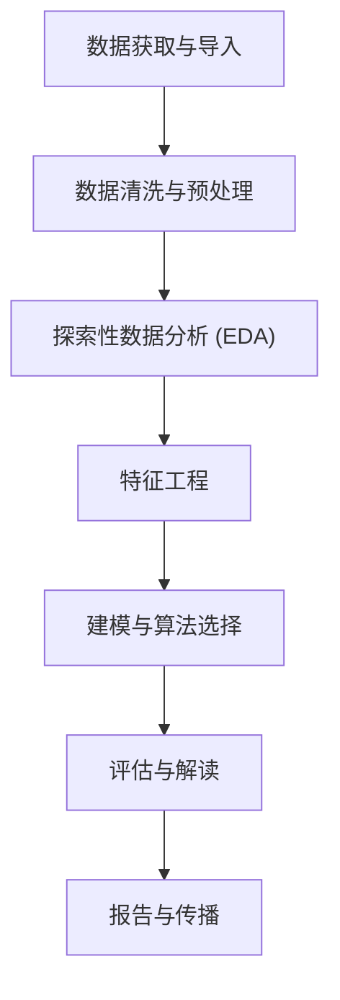

以下是仓库中完整数据分析工作流程的各主要阶段、子阶段及可选项的系统梳理。

---

## 完整数据分析工作流程



---

## 阶段一：数据获取与导入

这是工作流的起点，仓库提供了极为丰富的数据来源技能。

### 子阶段

| 子阶段 | 相关技能 | 可选项数量 |
|---|---|---|
| 数据库查询 | `database-lookup` | **78+ 数据库**（PubChem, ChEMBL, UniProt, NCBI, COSMIC 等） |
| 文献检索 | `paper-lookup`, `bgpt-paper-search`, `paperzilla` | **10 个学术数据库** |
| 专项数据集 | `depmap`, `primekg`, `cellxgene-census`, `imaging-data-commons` | 4 个专项数据库 |
| 云平台数据 | `dnanexus-integration`, `latchbio-integration` | 2 个云平台 | [1](#0-0) [2](#0-1) 

---

## 阶段二：数据清洗与预处理

### 子阶段及可选项

**2.1 文件类型识别与初步检查**
- `exploratory-data-analysis` 自动检测 200+ 格式，生成 Markdown 质量报告
- 子步骤：文件类型检测 → 格式信息加载 → 数据分析 → 报告生成 [3](#0-2) 

**2.2 缺失值处理（3 种策略）**

通过 `scikit-learn` 的 `preprocessing` 模块：
- `SimpleImputer`（均值/中位数/众数）
- `KNNImputer`（K近邻插补）
- `IterativeImputer`（多变量迭代插补） [4](#0-3) 

**2.3 特征缩放与归一化（4 种方法）**
- `StandardScaler`（零均值单位方差）
- `MinMaxScaler`（有界范围）
- `RobustScaler`（对异常值鲁棒）
- `Normalizer`（样本级归一化） [5](#0-4) 

**2.4 类别变量编码（3 种方法）**
- `OneHotEncoder`（名义类别）
- `OrdinalEncoder`（有序类别）
- `LabelEncoder`（目标编码）

**2.5 大数据集处理（3 种工具）**
- `polars`：Rust 实现，比 pandas 快 5-30 倍
- `dask`：超内存并行计算
- `vaex`：内存映射，每秒处理 10 亿行 [6](#0-5) 

**2.6 领域专项预处理**
- 单细胞数据：`scanpy`（QC 过滤、归一化、log 变换、高变基因识别）
- RNA-seq：`pydeseq2`（size factor 估计、方差稳定变换）
- 质谱数据：`pyopenms`、`matchms`
- 基因组文件：`pysam`（SAM/BAM/VCF）

**2.7 ：数据验证与质量控制**

```

### 1. `exploratory-data-analysis` skill
该 skill 的报告模板中专门设有 **Quality Assessment** 章节，采用的方法包括：
- **Completeness（完整性）**：检查缺失值、数据覆盖率 [1](#0-0) 
- **Validity（有效性）**：范围检查（Range Check）、格式合规性（Format Compliance）、一致性（Consistency）检查 [2](#0-1) 
- **Integrity（完整性/校验）**：校验和验证、文件损坏检查 [3](#0-2) 

这套方法整体构成了一个通用文件质量评估流程，输出到报告的 "Key Findings" 中给出数据质量结论 [4](#0-3) 。

### 2. `imaging-data-commons` skill（医学影像数据）
在处理 NCI Imaging Data Commons 的 DICOM 元数据时，该 skill 明确指出了数据质量的注意事项和方法：
- 识别不合理数值（如编码错误导致的异常 b-value） [5](#0-4) 
- 强调使用 IDC Viewer 对查询结果进行**可视化人工验证**，作为大规模分析前的质控步骤 [6](#0-5) 
- 提示同一 DICOM tag 在不同软件版本间含义可能不同，需要谨慎解读元数据 [7](#0-6) 

### 3. `scholar-evaluation` skill（科研评估）
该 skill 的评估框架中有专门维度用于评价数据质量与方法学的严谨性：
- 检查清单包含"数据来源是否可信"、"样本量是否充足"、"数据质控措施是否被描述"、"缺失数据如何处理"等 [8](#0-7) 
- 同时设有"分析与解释"维度，评估分析方法是否透明、可重复、假设是否被验证 [9](#0-8) 

### 4. `peer-review` skill
在同行评审的常见问题参考中，列出了识别数据/方法验证缺陷的方法，例如缺乏阳性/阴性对照、未验证特异性、检测限未确定等，并给出对应建议（如展示标准曲线、报告检测/定量限、跨重复和操作者验证再现性） [10](#0-9) 。此外还包含防止"挑选数据"（cherry-picking）和过度解读结果的质控建议 [11](#0-10) 。

### 5. `latchbio-integration` skill
在数据管理最佳实践中提到"Validation"（创建记录时验证数据类型）作为通用数据管理规范之一 [12](#0-11) 。

```

---

## 阶段三：探索性数据分析（EDA）

### 子阶段及可选项

**3.1 自动化 EDA**
- `exploratory-data-analysis`：一键生成统计摘要、质量指标、可视化建议、下游分析推荐 [7](#0-6) 

**3.2 统计检验（4 大类，10+ 种检验）**

通过 `statistical-analysis` 技能：

| 场景 | 参数检验 | 非参数替代 |
|---|---|---|
| 两组比较 | 独立/配对 t 检验 | Mann-Whitney U / Wilcoxon |
| 多组比较 | 单因素 ANOVA | Kruskal-Wallis / Friedman |
| 关系分析 | Pearson 相关 / 线性回归 | Spearman 相关 |
| 分类变量 | 卡方检验 | Fisher 精确检验 |
| 贝叶斯替代 | Bayesian t-test / ANOVA / 回归 | — | [8](#0-7) 

**3.3 可视化（3 个主要工具）**
- `matplotlib`：静态发表级图表（线图、散点图、直方图、3D 图等）
- `seaborn`：统计可视化（热图、小提琴图、回归图、置信区间）
- `plotly`：40+ 交互式图表类型

**3.4 假设检验前提检查（4 项自动检查）**
- 异常值检测（IQR + z-score）
- 正态性检验（Shapiro-Wilk + Q-Q 图）
- 方差齐性（Levene 检验）
- 线性性检验 [9](#0-8) 

---

## 阶段四：特征工程

### 子阶段及可选项

**4.1 特征构造（3 种方法）**
- `PolynomialFeatures`（多项式交互项）
- `KBinsDiscretizer`（分箱离散化）
- 自定义变换（`FunctionTransformer`）

**4.2 特征选择（3 类方法）**
- 过滤法：`SelectKBest`（统计得分）
- 包裹法：`RFE`（递归特征消除）
- 嵌入法：`SelectFromModel`（基于模型重要性） [10](#0-9) 

**4.3 降维（7 种方法）**
- 线性：`PCA`、`TruncatedSVD`、`NMF`
- 流形学习：`t-SNE`、`UMAP`（`umap-learn`）、`Isomap`、`LLE`

**4.4 分子特征化（100+ 特征器，通过 `molfeat`）**
- 分子指纹（ECFP, MACCS, RDKit, Pharmacophore）
- 分子描述符（2D/3D, 拓扑, 电子）
- 图表示（分子图）
- 预训练模型嵌入（MolBERT, ChemBERTa, Uni-Mol） [11](#0-10) 

**4.5 SHAP 驱动的特征工程**
- 识别非线性关系（变换候选）
- 识别特征交互（交互项候选）
- 工程新特征后对比 SHAP 值验证改进 [12](#0-11) 

---

## 阶段五：建模与算法选择

### 子阶段及可选项

**5.1 监督学习（17+ 分类/回归算法，通过 `scikit-learn`）**

| 类别 | 算法 |
|---|---|
| 线性模型 | Logistic Regression, Ridge, Lasso, ElasticNet |
| 树模型 | Decision Tree, Random Forest, Gradient Boosting, HistGradientBoosting |
| 支持向量机 | SVC, SVR（多种核函数） |
| 集成方法 | AdaBoost, Voting, Stacking |
| 神经网络 | MLPClassifier, MLPRegressor |
| 其他 | Naive Bayes, KNN | [13](#0-12) 

**5.2 无监督学习（8+ 聚类算法）**
- 划分法：K-Means, MiniBatchKMeans
- 密度法：DBSCAN, HDBSCAN, OPTICS
- 层次法：AgglomerativeClustering
- 概率法：Gaussian Mixture Models
- 其他：MeanShift, SpectralClustering, BIRCH [14](#0-13) 

**5.3 深度学习（多框架）**
- `pytorch-lightning`：通用深度学习（DDP/FSDP/DeepSpeed）
- `transformers`：1M+ 预训练模型（BERT, GPT, T5, ViT 等）
- `scvi-tools`：25+ 单细胞 VAE 模型
- `deepchem`：图卷积网络（GCN, GAT, MPNN, AttentiveFP）

**5.4 统计建模（3 种框架）**
- `statsmodels`：OLS, GLM, logit/probit, ARIMA
- `pymc`：贝叶斯概率编程（NUTS, MCMC, 变分推断）
- `scikit-survival`：Cox 比例风险模型、随机生存森林

**5.5 专域建模**
- 时间序列：`aeon`（13 类算法）、`timesfm-forecasting`（零样本预测）
- 图神经网络：`torch-geometric`
- 多目标优化：`pymoo`（NSGA-II, NSGA-III 等）
- 强化学习：`stable-baselines3`（PPO, SAC, DQN 等）

---

## 阶段六：评估与解读

### 子阶段及可选项

**6.1 模型评估指标**

| 任务类型 | 指标 |
|---|---|
| 分类 | accuracy, precision, recall, F1, ROC AUC, confusion matrix |
| 回归 | MSE, RMSE, MAE, R², MAPE |
| 聚类 | silhouette score, Calinski-Harabasz, Davies-Bouldin |
| 生存分析 | concordance index, time-dependent AUC, Brier score | [15](#0-14) 

**6.2 交叉验证策略（4 种）**
- `KFold`（通用）
- `StratifiedKFold`（分类任务）
- `TimeSeriesSplit`（时序数据）
- `GroupKFold`（分组样本）

**6.3 超参数调优（3 种方法）**
- `GridSearchCV`（穷举搜索）
- `RandomizedSearchCV`（随机采样）
- `HalvingGridSearchCV`（逐步减半）

**6.4 模型可解释性（6 种 SHAP 解释器）**
- `TreeExplainer`（树模型，最快）
- `LinearExplainer`（线性模型，近乎即时）
- `DeepExplainer`（深度学习）
- `GradientExplainer`（梯度法）
- `KernelExplainer`（模型无关）
- `PermutationExplainer`（精确但慢） [16](#0-15) 

**6.5 效应量与统计显著性**
- Cohen's d（t 检验）、η²（ANOVA）、r（相关）、R²（回归）、Cramér's V（卡方）
- 置信区间、功效分析（事前/事后） [17](#0-16) 

---

## 阶段七：报告与传播

### 子阶段及可选项

**7.1 报告生成（4 种格式）**
- `scientific-writing`：IMRAD 格式学术论文
- `clinical-reports`：CARE/ICH-E3 临床报告 PDF
- `market-research-reports`：50+ 页咨询风格报告
- `markdown-mermaid-writing`：Markdown + 流程图文档

**7.2 可视化输出**
- `scientific-visualization`：发表级 matplotlib/seaborn 图表
- `scientific-schematics`：AI 生成科学示意图
- `latex-posters` / `pptx-posters`：会议海报 [18](#0-17) 

---

## 汇总：各阶段可选项数量


仓库中的 134 个技能覆盖了从原始数据到发表报告的完整链路，每个主要阶段均可细分为 3-5 个子阶段，且每个子阶段都提供多个可互换的工具选项，以适应不同数据类型（基因组、化学、临床、通用表格等）和规模需求。 [19](#0-18) [20](#0-19)

### Citations

**File:** docs/scientific-skills.md (L3-9)
```markdown
## Scientific Databases & Data Access

- **Database Lookup** - Search 78 public scientific, biomedical, materials science, and economic databases via their REST APIs and return structured JSON results. Covers physics/astronomy (NASA, NIST, SDSS, SIMBAD, Exoplanet Archive), earth/environment (USGS, NOAA, EPA, OpenWeatherMap), chemistry/drugs (PubChem, ChEMBL, DrugBank, FDA, KEGG, DailyMed, ZINC, BindingDB), materials science (Materials Project, COD), biology/genomics (Reactome, BRENDA, UniProt, STRING, Ensembl, NCBI Gene, GEO, GTEx, PDB, AlphaFold, InterPro, ChEBI, BioGRID, Gene Ontology, QuickGO, NCBI Protein/Taxonomy, dbSNP, SRA, ENA, gnomAD, UCSC Genome, ENCODE, JASPAR, MouseMine, PRIDE, LINCS L1000, Human Protein Atlas, Human Cell Atlas, RummaGEO, Metabolomics Workbench, EMDB, Addgene), disease/clinical (COSMIC, Open Targets ... (truncated)
- **DepMap** - Query the Cancer Dependency Map (DepMap) for cancer cell line gene dependency scores (CRISPR Chronos), drug sensitivity data, and gene effect profiles. Use for identifying cancer-specific vulnerabilities, synthetic lethal interactions, and validating oncology drug targets
- **Imaging Data Commons** - Query and download public cancer imaging data from NCI Imaging Data Commons using idc-index. Use for accessing large-scale radiology (CT, MR, PET) and pathology datasets for AI training or research. No authentication required. Query by metadata, visualize in browser, check licenses
- **PrimeKG** - Query the Precision Medicine Knowledge Graph (PrimeKG) for multiscale biological data including genes, drugs, diseases, phenotypes, and more. Integrates 20+ biomedical resources into a single knowledge graph for drug repurposing, disease mechanism exploration, and target identification
- **U.S. Treasury Fiscal Data** - Free, open REST API from the U.S. Department of the Treasury providing 54 datasets and 182 data tables covering federal fiscal data. No API key required. Access national debt (Debt to the Penny back to 1993, Historical Debt back to 1790), Daily Treasury Statements (TGA balances, deposits/withdrawals), Monthly Treasury Statements (federal budget receipts and outlays), Treasury securities auctions data (bills, notes, bonds, TIPS, FRNs since 1979), average interest rates on Treasury securities, Treasury reporting exchange rates (quarterly for 170+ currencies), I Bond and savings bond rates, TIPS/CPI data, and more. Supports filtering, sorting, pagination, and CSV/XML/JSON output formats
```

**File:** docs/scientific-skills.md (L69-70)
```markdown
- **Molfeat** - Comprehensive Python library providing 100+ molecular featurizers for converting molecules into numerical representations suitable for machine learning. Includes molecular fingerprints (ECFP, MACCS, RDKit, Pharmacophore), molecular descriptors (2D/3D descriptors, constitutional, topological, electronic), graph-based representations (molecular graphs, line graphs), and pre-trained models (MolBERT, ChemBERTa, Uni-Mol embeddings). Features unified API across different featurizer types, caching for performance, parallel processing, and integration with popular ML frameworks (scikit-learn, PyTorch, TensorFlow). Supports both traditional cheminformatics descriptors and modern learned representations. Use cases: molecular property prediction, virtual screening, molecular similarit ... (truncated)
- **PyTDC** - Python library providing access to Therapeutics Data Commons (TDC), a collection of curated datasets and benchmarks for drug discovery and development. Includes datasets for ADMET prediction (absorption, distribution, metabolism, excretion, toxicity), drug-target interactions, drug-drug interactions, drug response prediction, molecular generation, and retrosynthesis. Features standardized data formats, data loaders with automatic preprocessing, benchmark tasks with evaluation metrics, leaderboards for model comparison, and integration with popular ML frameworks. Provides both single-molecule and drug-pair datasets, covering various stages of drug discovery from target identification to clinical outcomes. Use cases: benchmarking ML models for drug discovery, ADMET prediction m ... (truncated)
```

**File:** docs/scientific-skills.md (L134-143)
```markdown
- **Dask** - Parallel computing for larger-than-memory datasets with distributed DataFrames, Arrays, Bags, and Futures
- **GeoMaster** - Comprehensive geospatial science skill covering remote sensing, GIS, spatial analysis, machine learning for earth observation, and 30+ scientific domains. Supports satellite imagery processing (Sentinel, Landsat, MODIS, SAR, hyperspectral), vector and raster data operations, spatial statistics, point cloud processing, network analysis, cloud-native workflows (STAC, COG, Planetary Computer), and 8 programming languages (Python, R, Julia, JavaScript, C++, Java, Go, Rust) with 500+ code examples. Use for remote sensing workflows, GIS analysis, spatial ML, Earth observation data processing, terrain analysis, hydrological modeling, marine spatial analysis, atmospheric science, and any geospatial computation task
- **GeoPandas** - Python library extending pandas for working with geospatial vector data including shapefiles, GeoJSON, and GeoPackage files. Provides GeoDataFrame and GeoSeries data structures combining geometric data with tabular attributes for spatial analysis. Key features include: reading/writing spatial file formats (Shapefile, GeoJSON, GeoPackage, PostGIS, Parquet) with Arrow acceleration for 2-4x faster I/O, geometric operations (buffer, simplify, centroid, convex hull, affine transformations) through Shapely integration, spatial analysis (spatial joins with predicates like intersects/contains/within, nearest neighbor joins, overlay operations for union/intersection/difference, dissolve for aggregation, clipping), coordinate reference system (CRS) management (setting CRS, reprojec ... (truncated)
- **Matplotlib** - Comprehensive Python plotting library for creating publication-quality static, animated, and interactive visualizations. Provides extensive customization options for creating figures, subplots, axes, and annotations. Key features include: support for multiple plot types (line, scatter, bar, histogram, contour, 3D, and many more), extensive customization (colors, fonts, styles, layouts), multiple backends (PNG, PDF, SVG, interactive backends), LaTeX integration for mathematical notation, and integration with NumPy and pandas. Includes specialized modules (pyplot for MATLAB-like interface, artist layer for fine-grained control, backend layer for rendering). Supports complex multi-panel figures, color maps, legends, and annotations. Use cases: scientific figure creation, da ... (truncated)
- **NetworkX** - Comprehensive toolkit for creating, analyzing, and visualizing complex networks and graphs. Supports four graph types (Graph, DiGraph, MultiGraph, MultiDiGraph) with nodes as any hashable objects and rich edge attributes. Provides 100+ algorithms including shortest paths (Dijkstra, Bellman-Ford, A*), centrality measures (degree, betweenness, closeness, eigenvector, PageRank), clustering (coefficients, triangles, transitivity), community detection (modularity-based, label propagation, Girvan-Newman), connectivity analysis (components, cuts, flows), tree algorithms (MST, spanning trees), matching, graph coloring, isomorphism, and traversal (DFS, BFS). Includes 50+ graph generators for classic (complete, cycle, wheel), random (Erdős-Rényi, Barabási-Albert, Watts-Strogatz, sto ... (truncated)
- **Plotly** - Interactive scientific and statistical data visualization library for Python with 40+ chart types. Provides both high-level API (Plotly Express) for quick visualizations and low-level API (graph objects) for fine-grained control. Key features include: comprehensive chart types (scatter, line, bar, histogram, box, violin, heatmap, contour, 3D plots, geographic maps, financial charts, statistical distributions, hierarchical charts), interactive features (hover tooltips, pan/zoom, legend toggling, animations, rangesliders, buttons/dropdowns), publication-quality output (static images in PNG/PDF/SVG via Kaleido, interactive HTML with embeddable figures), extensive customization (templates, themes, color scales, fonts, layouts, annotations, shapes), subplot support (multi-plot fi ... (truncated)
- **Polars** - High-performance DataFrame library written in Rust with Python bindings, designed for fast data manipulation and analysis. Provides lazy evaluation for query optimization, efficient memory usage, and parallel processing. Key features include: DataFrame operations (filtering, grouping, joining, aggregations), support for large datasets (larger than RAM), integration with pandas and NumPy, expression API for complex transformations, and support for multiple data formats (CSV, Parquet, JSON, Excel, Arrow). Features query optimization through lazy evaluation, automatic parallelization, and efficient memory management. Often 5-30x faster than pandas for many operations. Use cases: large-scale data processing, ETL pipelines, data analysis workflows, and high-performance data manip ... (truncated)
- **Seaborn** - Statistical data visualization with dataset-oriented interface, automatic confidence intervals, publication-quality themes, colorblind-safe palettes, and comprehensive support for exploratory analysis, distribution comparisons, correlation matrices, regression plots, and multi-panel figures
- **Vaex** - High-performance Python library for lazy, out-of-core DataFrames to process and visualize tabular datasets larger than available RAM. Processes over a billion rows per second through memory-mapped files (HDF5, Apache Arrow), lazy evaluation, and virtual columns (zero memory overhead). Provides instant file opening, efficient aggregations across billions of rows, interactive visualizations without sampling, machine learning pipelines with transformers (scalers, encoders, PCA), and seamless integration with pandas/NumPy/Arrow. Includes comprehensive ML framework (vaex.ml) with feature scaling, categorical encoding, dimensionality reduction, and integration with scikit-learn/XGBoost/LightGBM/CatBoost. Supports distributed computing via Dask, asynchronous operations, and state man ... (truncated)

```

**File:** docs/scientific-skills.md (L152-166)
```markdown
### Scientific Communication & Publishing
- **BGPT Paper Search** - Search scientific papers and retrieve structured experimental data extracted from full-text studies via the BGPT MCP server. Returns 25+ fields per paper including methods, results, sample sizes, quality scores, and conclusions. Use for literature reviews, evidence synthesis, and finding experimental details not available in abstracts alone
- **pyzotero** - Python client for the Zotero Web API v3. Programmatically manage Zotero reference libraries: retrieve, create, update, and delete items, collections, tags, and attachments. Export citations as BibTeX, CSL-JSON, and formatted bibliography HTML. Supports user and group libraries, local mode for offline access, paginated retrieval with `everything()`, full-text content indexing, saved search management, and file upload/download. Includes a CLI for searching your local Zotero library. Use cases: building research automation pipelines that integrate with Zotero, bulk importing references, exporting bibliographies programmatically, managing large reference collections, syncing library metadata, and enriching bibliographic data.
- **Citation Management** - Comprehensive citation management for academic research. Search Google Scholar and PubMed for papers, extract accurate metadata from multiple sources (CrossRef, PubMed, arXiv), validate citations, and generate properly formatted BibTeX entries. Features include converting DOIs, PMIDs, or arXiv IDs to BibTeX, cleaning and formatting bibliography files, finding highly cited papers, checking for duplicates, and ensuring consistent citation formatting. Use cases: building bibliographies for manuscripts, verifying citation accuracy, citation deduplication, and maintaining reference databases
- **Generate Image** - AI-powered image generation and editing for scientific illustrations, schematics, and visualizations using OpenRouter's image generation models. Supports multiple models including google/gemini-3-pro-image-preview (high quality, recommended default) and black-forest-labs/flux.2-pro (fast, high quality). Key features include: text-to-image generation from detailed prompts, image editing capabilities (modify existing images with natural language instructions), automatic base64 encoding/decoding, PNG output with configurable paths, and comprehensive error handling. Requires OpenRouter API key (via .env file or environment variable). Use cases: generating scientific diagrams and illustrations, creating publication-quality figures, editing existing images (changing colors ... (truncated)
- **Infographics** - Create professional infographics using Nano Banana Pro AI with smart iterative refinement. Uses Gemini 3 Pro for quality review. Integrates research-lookup and web search for accurate data. Supports 10 infographic types, 8 industry styles, and colorblind-safe palettes
- **LaTeX Posters** - Create professional research posters in LaTeX using beamerposter, tikzposter, or baposter. Support for conference presentations, academic posters, and scientific communication with layout design, color schemes, multi-column formats, figure integration, and poster-specific best practices. Features compliance with conference size requirements (A0, A1, 36×48"), complex multi-column layouts, and integration of figures, tables, equations, and citations. Use cases: conference poster sessions, thesis defenses, symposia presentations, and research group templates
- **Market Research Reports** - Generate comprehensive market research reports (50+ pages) in the style of top consulting firms (McKinsey, BCG, Gartner). Features professional LaTeX formatting, extensive visual generation, deep integration with research-lookup for data gathering, and multi-framework strategic analysis including Porter's Five Forces, PESTLE, SWOT, TAM/SAM/SOM, and BCG Matrix. Use cases: investment decisions, strategic planning, competitive landscape analysis, market sizing, and market entry evaluation
- **Paper-2-Web** - Autonomous pipeline for transforming academic papers into multiple promotional formats using the Paper2All system. Converts LaTeX or PDF papers into: (1) Paper2Web - interactive, layout-aware academic homepages with responsive design, interactive figures, and mobile support; (2) Paper2Video - professional presentation videos with slides, narration, cursor movements, and optional talking-head generation using Hallo2; (3) Paper2Poster - print-ready conference posters with custom dimensions, professional layouts, and institution branding. Supports GPT-4/GPT-4.1 models, batch processing, QR code generation, multi-language content, and quality assessment metrics. Use cases: conference materials, video abstracts, preprint enhancement, research promotion, poster sessions, and  ... (truncated)
- **Perplexity Search** - AI-powered web search using Perplexity models via LiteLLM and OpenRouter for real-time, web-grounded answers with source citations. Provides access to multiple Perplexity models: Sonar Pro (general-purpose, best cost-quality balance), Sonar Pro Search (most advanced agentic search with multi-step reasoning), Sonar (cost-effective for simple queries), Sonar Reasoning Pro (advanced step-by-step analysis), and Sonar Reasoning (basic reasoning). Key features include: single OpenRouter API key setup (no separate Perplexity account), real-time access to current information beyond training data cutoff, comprehensive query design guidance (domain-specific patterns, time constraints, source preferences), cost optimization strategies with usage monitoring, programmatic and  ... (truncated)
- **PPTX Posters** - Create professional research posters using PowerPoint/HTML formats for researchers who prefer WYSIWYG tools over LaTeX. Features design principles, layout templates, quality checklists, and export guidance for poster sessions. Use cases: conference posters when LaTeX is not preferred, quick poster creation, and collaborative poster design
- **Scientific Schematics** - Create publication-quality scientific diagrams using Nano Banana Pro AI with smart iterative refinement. Uses Gemini 3 Pro for quality review with document-type-specific thresholds (journal: 8.5/10, conference: 8.0/10, poster: 7.0/10). Specializes in neural network architectures, system diagrams, flowcharts, biological pathways, and complex scientific visualizations. Features natural language input, automatic quality assessment, and publication-ready output. Use cases: creating figures for papers, generating workflow diagrams, visualizing experimental designs, and producing graphical abstracts
- **Scientific Slides** - Build slide decks and presentations for research talks using PowerPoint and LaTeX Beamer. Features slide structure, design templates, timing guidance, and visual validation. Emphasizes visual engagement with minimal text, research-backed content with proper citations, and story-driven narrative. Use cases: conference presentations, academic seminars, thesis defenses, grant pitches, and professional talks
- **Venue Templates** - Access comprehensive LaTeX templates, formatting requirements, and submission guidelines for major scientific publication venues (Nature, Science, PLOS, IEEE, ACM), academic conferences (NeurIPS, ICML, CVPR, CHI), research posters, and grant proposals (NSF, NIH, DOE, DARPA). Provides ready-to-use templates and detailed specifications for successful academic submissions. Use cases: manuscript preparation, conference papers, research posters, and grant proposals with venue-specific formatting

```

**File:** scientific-skills/exploratory-data-analysis/SKILL.md (L34-78)
```markdown
## Supported File Categories

The skill has comprehensive coverage of scientific file formats organized into six major categories:

### 1. Chemistry and Molecular Formats (60+ extensions)
Structure files, computational chemistry outputs, molecular dynamics trajectories, and chemical databases.

**File types include:** `.pdb`, `.cif`, `.mol`, `.mol2`, `.sdf`, `.xyz`, `.smi`, `.gro`, `.log`, `.fchk`, `.cube`, `.dcd`, `.xtc`, `.trr`, `.prmtop`, `.psf`, and more.

**Reference file:** `references/chemistry_molecular_formats.md`

### 2. Bioinformatics and Genomics Formats (50+ extensions)
Sequence data, alignments, annotations, variants, and expression data.

**File types include:** `.fasta`, `.fastq`, `.sam`, `.bam`, `.vcf`, `.bed`, `.gff`, `.gtf`, `.bigwig`, `.h5ad`, `.loom`, `.counts`, `.mtx`, and more.

**Reference file:** `references/bioinformatics_genomics_formats.md`

### 3. Microscopy and Imaging Formats (45+ extensions)
Microscopy images, medical imaging, whole slide imaging, and electron microscopy.

**File types include:** `.tif`, `.nd2`, `.lif`, `.czi`, `.ims`, `.dcm`, `.nii`, `.mrc`, `.dm3`, `.vsi`, `.svs`, `.ome.tiff`, and more.

**Reference file:** `references/microscopy_imaging_formats.md`

### 4. Spectroscopy and Analytical Chemistry Formats (35+ extensions)
NMR, mass spectrometry, IR/Raman, UV-Vis, X-ray, chromatography, and other analytical techniques.

**File types include:** `.fid`, `.mzML`, `.mzXML`, `.raw`, `.mgf`, `.spc`, `.jdx`, `.xy`, `.cif` (crystallography), `.wdf`, and more.

**Reference file:** `references/spectroscopy_analytical_formats.md`

### 5. Proteomics and Metabolomics Formats (30+ extensions)
Mass spec proteomics, metabolomics, lipidomics, and multi-omics data.

**File types include:** `.mzML`, `.pepXML`, `.protXML`, `.mzid`, `.mzTab`, `.sky`, `.mgf`, `.msp`, `.h5ad`, and more.

**Reference file:** `references/proteomics_metabolomics_formats.md`

### 6. General Scientific Data Formats (30+ extensions)
Arrays, tables, hierarchical data, compressed archives, and common scientific formats.

**File types include:** `.npy`, `.npz`, `.csv`, `.xlsx`, `.json`, `.hdf5`, `.zarr`, `.parquet`, `.mat`, `.fits`, `.nc`, `.xml`, and more.

**Reference file:** `references/general_scientific_formats.md`
```

**File:** scientific-skills/exploratory-data-analysis/SKILL.md (L82-113)
```markdown
### Step 1: File Type Detection

When a user provides a file path, first identify the file type:

1. Extract the file extension
2. Look up the extension in the appropriate reference file
3. Identify the file category and format description
4. Load format-specific information

**Example:**
```
User: "Analyze data.fastq"
→ Extension: .fastq
→ Category: bioinformatics_genomics
→ Format: FASTQ Format (sequence data with quality scores)
→ Reference: references/bioinformatics_genomics_formats.md
```

### Step 2: Load Format-Specific Information

Based on the file type, read the corresponding reference file to understand:
- **Typical Data:** What kind of data this format contains
- **Use Cases:** Common applications for this format
- **Python Libraries:** How to read the file in Python
- **EDA Approach:** What analyses are appropriate for this data type

Search the reference file for the specific extension (e.g., search for "### .fastq" in `bioinformatics_genomics_formats.md`).

### Step 3: Perform Data Analysis

Use the `scripts/eda_analyzer.py` script OR implement custom analysis:

```

**File:** scientific-skills/exploratory-data-analysis/SKILL.md (L154-197)
```markdown
### Step 4: Generate Comprehensive Report

Create a markdown report with the following sections:

#### Required Sections:
1. **Title and Metadata**
   - Filename and timestamp
   - File size and location

2. **Basic Information**
   - File properties
   - Format identification

3. **File Type Details**
   - Format description from reference
   - Typical data content
   - Common use cases
   - Python libraries for reading

4. **Data Analysis**
   - Structure and dimensions
   - Statistical summaries
   - Quality assessment
   - Data characteristics

5. **Key Findings**
   - Notable patterns
   - Potential issues
   - Quality metrics

6. **Recommendations**
   - Preprocessing steps
   - Appropriate analyses
   - Tools and methods
   - Visualization approaches

#### Template Location
Use `assets/report_template.md` as a guide for report structure.

### Step 5: Save Report

Save the markdown report with a descriptive filename:
- Pattern: `{original_filename}_eda_report.md`
- Example: `experiment_data.fastq` → `experiment_data_eda_report.md`
```

**File:** scientific-skills/scikit-learn/SKILL.md (L114-130)
```markdown
### 1. Supervised Learning

Comprehensive algorithms for classification and regression tasks.

**Key algorithms:**
- **Linear models**: Logistic Regression, Linear Regression, Ridge, Lasso, ElasticNet
- **Tree-based**: Decision Trees, Random Forest, Gradient Boosting
- **Support Vector Machines**: SVC, SVR with various kernels
- **Ensemble methods**: AdaBoost, Voting, Stacking
- **Neural Networks**: MLPClassifier, MLPRegressor
- **Others**: Naive Bayes, K-Nearest Neighbors

**When to use:**
- Classification: Predicting discrete categories (spam detection, image classification, fraud detection)
- Regression: Predicting continuous values (price prediction, demand forecasting)

**See:** `references/supervised_learning.md` for detailed algorithm documentation, parameters, and usage examples.
```

**File:** scientific-skills/scikit-learn/SKILL.md (L136-148)
```markdown
**Clustering algorithms:**
- **Partition-based**: K-Means, MiniBatchKMeans
- **Density-based**: DBSCAN, HDBSCAN, OPTICS
- **Hierarchical**: AgglomerativeClustering
- **Probabilistic**: Gaussian Mixture Models
- **Others**: MeanShift, SpectralClustering, BIRCH

**Dimensionality reduction:**
- **Linear**: PCA, TruncatedSVD, NMF
- **Manifold learning**: t-SNE, UMAP, Isomap, LLE
- **Feature extraction**: FastICA, LatentDirichletAllocation

**When to use:**
```

**File:** scientific-skills/scikit-learn/SKILL.md (L159-178)
```markdown
**Cross-validation strategies:**
- KFold, StratifiedKFold (classification)
- TimeSeriesSplit (temporal data)
- GroupKFold (grouped samples)

**Hyperparameter tuning:**
- GridSearchCV (exhaustive search)
- RandomizedSearchCV (random sampling)
- HalvingGridSearchCV (successive halving)

**Metrics:**
- **Classification**: accuracy, precision, recall, F1-score, ROC AUC, confusion matrix
- **Regression**: MSE, RMSE, MAE, R², MAPE
- **Clustering**: silhouette score, Calinski-Harabasz, Davies-Bouldin

**When to use:**
- Comparing model performance objectively
- Finding optimal hyperparameters
- Preventing overfitting through cross-validation
- Understanding model behavior with learning curves
```

**File:** scientific-skills/scikit-learn/SKILL.md (L182-213)
```markdown
### 4. Data Preprocessing

Transform raw data into formats suitable for machine learning.

**Scaling and normalization:**
- StandardScaler (zero mean, unit variance)
- MinMaxScaler (bounded range)
- RobustScaler (robust to outliers)
- Normalizer (sample-wise normalization)

**Encoding categorical variables:**
- OneHotEncoder (nominal categories)
- OrdinalEncoder (ordered categories)
- LabelEncoder (target encoding)

**Handling missing values:**
- SimpleImputer (mean, median, most frequent)
- KNNImputer (k-nearest neighbors)
- IterativeImputer (multivariate imputation)

**Feature engineering:**
- PolynomialFeatures (interaction terms)
- KBinsDiscretizer (binning)
- Feature selection (RFE, SelectKBest, SelectFromModel)

**When to use:**
- Before training any algorithm that requires scaled features (SVM, KNN, Neural Networks)
- Converting categorical variables to numeric format
- Handling missing data systematically
- Creating non-linear features for linear models

**See:** `references/preprocessing.md` for detailed preprocessing techniques.
```

**File:** scientific-skills/statistical-analysis/SKILL.md (L83-113)
```markdown
## Test Selection Guide

### Quick Reference: Choosing the Right Test

Use `references/test_selection_guide.md` for comprehensive guidance. Quick reference:

**Comparing Two Groups:**
- Independent, continuous, normal → Independent t-test
- Independent, continuous, non-normal → Mann-Whitney U test
- Paired, continuous, normal → Paired t-test
- Paired, continuous, non-normal → Wilcoxon signed-rank test
- Binary outcome → Chi-square or Fisher's exact test

**Comparing 3+ Groups:**
- Independent, continuous, normal → One-way ANOVA
- Independent, continuous, non-normal → Kruskal-Wallis test
- Paired, continuous, normal → Repeated measures ANOVA
- Paired, continuous, non-normal → Friedman test

**Relationships:**
- Two continuous variables → Pearson (normal) or Spearman correlation (non-normal)
- Continuous outcome with predictor(s) → Linear regression
- Binary outcome with predictor(s) → Logistic regression

**Bayesian Alternatives:**
All tests have Bayesian versions that provide:
- Direct probability statements about hypotheses
- Bayes Factors quantifying evidence
- Ability to support null hypothesis
- See `references/bayesian_statistics.md`

```

**File:** scientific-skills/statistical-analysis/SKILL.md (L136-143)
```markdown
This performs:
1. **Outlier detection** (IQR and z-score methods)
2. **Normality testing** (Shapiro-Wilk test + Q-Q plots)
3. **Homogeneity of variance** (Levene's test + box plots)
4. **Interpretation and recommendations**

### Individual Assumption Checks

```

**File:** scientific-skills/statistical-analysis/SKILL.md (L340-350)
```markdown
### Quick Reference: Common Effect Sizes

| Test | Effect Size | Small | Medium | Large |
|------|-------------|-------|--------|-------|
| T-test | Cohen's d | 0.20 | 0.50 | 0.80 |
| ANOVA | η²_p | 0.01 | 0.06 | 0.14 |
| Correlation | r | 0.10 | 0.30 | 0.50 |
| Regression | R² | 0.02 | 0.13 | 0.26 |
| Chi-square | Cramér's V | 0.07 | 0.21 | 0.35 |

**Important**: Benchmarks are guidelines. Context matters!
```

**File:** scientific-skills/shap/SKILL.md (L42-58)
```markdown
**Decision Tree**:

1. **Tree-based model?** (XGBoost, LightGBM, CatBoost, Random Forest, Gradient Boosting)
   - Use `shap.TreeExplainer` (fast, exact)

2. **Deep neural network?** (TensorFlow, PyTorch, Keras, CNNs, RNNs, Transformers)
   - Use `shap.DeepExplainer` or `shap.GradientExplainer`

3. **Linear model?** (Linear/Logistic Regression, GLMs)
   - Use `shap.LinearExplainer` (extremely fast)

4. **Any other model?** (SVMs, custom functions, black-box models)
   - Use `shap.KernelExplainer` (model-agnostic but slower)

5. **Unsure?**
   - Use `shap.Explainer` (automatically selects best algorithm)

```

**File:** scientific-skills/shap/SKILL.md (L160-173)
```markdown
### Workflow 3: Feature Engineering

**Goal**: Use SHAP insights to improve features

**Steps**:
1. Compute SHAP values for baseline model
2. Identify nonlinear relationships (candidates for transformation)
3. Identify feature interactions (candidates for interaction terms)
4. Engineer new features
5. Retrain and compare SHAP values
6. Validate improvements

**See `references/workflows.md` for detailed feature engineering workflow.**

```

**File:** docs/examples.md (L54-119)
```markdown
**Workflow**:

```bash
# Always use available 'skills' when possible. Keep the output organized.

Step 1: Query ChEMBL for known EGFR inhibitors with high potency
- Search for compounds targeting EGFR (CHEMBL203)
- Filter: IC50 < 50 nM, pChEMBL value > 7
- Extract SMILES strings and activity data
- Export to DataFrame for analysis

Step 2: Analyze structure-activity relationships
- Load compounds into RDKit
- Calculate molecular descriptors (MW, LogP, TPSA, HBD, HBA)
- Generate Morgan fingerprints (radius=2, 2048 bits)
- Perform hierarchical clustering to identify scaffolds
- Visualize top scaffolds with activity annotations

Step 3: Identify resistance mutations from COSMIC
- Query COSMIC for EGFR mutations in lung cancer
- Focus on gatekeeper mutations (T790M, C797S)
- Extract mutation frequencies and clinical significance
- Cross-reference with literature in PubMed

Step 4: Retrieve EGFR structure from AlphaFold
- Download AlphaFold prediction for EGFR kinase domain
- Alternatively, use experimental structure from PDB (if available)
- Prepare structure for docking (add hydrogens, optimize)

Step 5: Generate novel analogs using datamol
- Select top 5 scaffolds from ChEMBL analysis
- Use scaffold decoration to generate 100 analogs per scaffold
- Apply Lipinski's Rule of Five filtering
- Ensure synthetic accessibility (SA score < 4)
- Check for PAINS and unwanted substructures

Step 6: Predict properties with DeepChem
- Train graph convolutional model on ChEMBL EGFR data
- Predict pIC50 for generated analogs
- Predict ADMET properties (solubility, permeability, hERG)
- Rank candidates by predicted potency and drug-likeness

Step 7: Virtual screening with DiffDock
- Perform molecular docking on top 50 candidates
- Dock into wild-type EGFR and T790M mutant
- Calculate binding energies and interaction patterns
- Identify compounds with favorable binding to both forms

Step 8: Search PubChem for commercial availability
- Query PubChem for top 10 candidates by InChI key
- Check supplier information and purchasing options
- Identify close analogs if exact matches unavailable

Step 9: Literature validation with PubMed
- Search for any prior art on top scaffolds
- Query: "[scaffold_name] AND EGFR AND inhibitor"
- Summarize relevant findings and potential liabilities

Step 10: Create comprehensive report
- Generate 2D structure visualizations of top hits
- Create scatter plots: MW vs LogP, TPSA vs potency
- Produce binding pose figures for top 3 compounds
- Generate table comparing properties to approved drugs (gefitinib, erlotinib)
- Write scientific summary with methodology, results, and recommendations
- Export to PDF with proper citations

```
