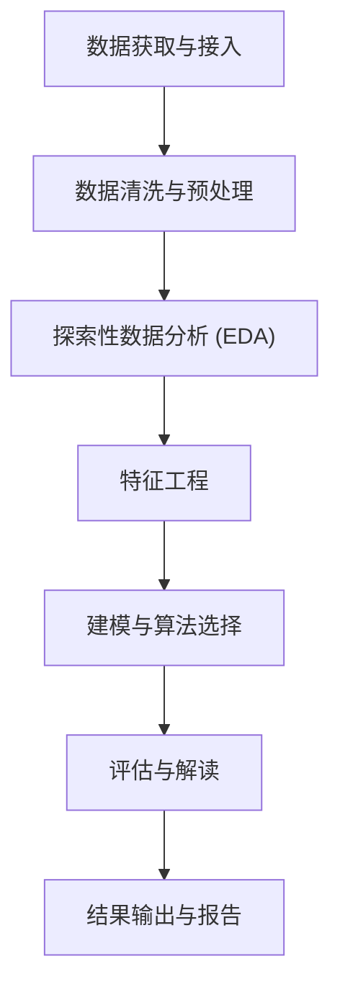

以下是对仓库中完整数据分析工作流程的系统梳理，涵盖每个主要阶段、细分小阶段及可选工具数量。

---

## 完整数据分析工作流程



---

## 阶段 0：数据获取与接入

这是仓库中独立存在的前置阶段，通过 `database-lookup` 统一网关访问 78+ 数据库。 [1](#0-0) 

| 小阶段 | 可选项 | 代表 Skill |
|---|---|---|
| 公共数据库查询 | 78+ 数据库 (PubChem, UniProt, COSMIC, GEO...) | `database-lookup` |
| 文献检索 | 10 个学术数据库 | `paper-lookup`, `bgpt-paper-search` |
| 专项数据平台 | 4 个 | `depmap`, `primekg`, `imaging-data-commons`, `usfiscaldata` |
| 云平台数据管理 | 3 个 | `dnanexus-integration`, `latchbio-integration`, `lamindb` |

---

## 阶段 1：数据清洗与预处理

**核心 Skill**：`exploratory-data-analysis`（支持 200+ 科学文件格式自动检测）、`scikit-learn`（preprocessing 模块） [2](#0-1) [3](#0-2) 

### 1.1 数据加载与格式识别
- **可选项：6 大类 200+ 格式**
  - 化学/分子格式（60+ 扩展名）：`.pdb`, `.sdf`, `.mol`, `.xyz`...
  - 生信/基因组格式（50+ 扩展名）：`.fasta`, `.bam`, `.vcf`, `.h5ad`...
  - 显微镜/成像格式（45+ 扩展名）：`.tif`, `.dcm`, `.nd2`, `.svs`...
  - 光谱/分析化学格式（35+ 扩展名）：`.mzML`, `.fid`, `.raw`...
  - 蛋白质组/代谢组格式（30+ 扩展名）
  - 通用科学格式（30+ 扩展名）：`.csv`, `.hdf5`, `.parquet`, `.zarr`...

### 1.2 数据质量评估（QC）
- **可选项：10+ 领域专用工具**

| 数据类型 | 可选 Skill |
|---|---|
| 单细胞 RNA-seq | `scanpy`（n_genes, pct_mt, n_counts 三指标） |
| 批量 RNA-seq | `pydeseq2`（size factor 估计） |
| 质谱数据 | `matchms`（40+ 过滤器）、`pyopenms` |
| 基因组比对 | `pysam`（SAM/BAM/VCF 质量过滤） |
| 生理信号 | `neurokit2`（ECG/EEG/EDA 信号质量） |
| 医学影像 | `pydicom`、`histolab`、`pathml` |
| 流式细胞 | `flowio` |
| 序列数据 | `biopython` |

### 1.3 缺失值处理
- **可选项：3 种策略**（均来自 `scikit-learn`）
  - `SimpleImputer`：均值/中位数/众数填充
  - `KNNImputer`：K 近邻插补
  - `IterativeImputer`：多变量迭代插补

### 1.4 数据缩放与归一化
- **可选项：4 种**（`scikit-learn`）
  - `StandardScaler`（零均值单位方差）
  - `MinMaxScaler`（有界范围）
  - `RobustScaler`（对异常值鲁棒）
  - `Normalizer`（样本级归一化）

### 1.5 类别变量编码
- **可选项：3 种**（`scikit-learn`）
  - `OneHotEncoder`（名义类别）
  - `OrdinalEncoder`（有序类别）
  - `LabelEncoder`（目标编码）

### 1.6 大规模数据处理框架
- **可选项：3 种** [4](#0-3) 

  - `dask`：并行计算，超内存 DataFrame
  - `vaex`：内存映射，10 亿行/秒处理
  - `polars`：Rust 实现，比 pandas 快 5-30x

### 1.7 批次效应校正（生物数据专用）
- **可选项：3 种**
  - `scanpy`：ComBat 批次校正
  - `scvi-tools`：深度学习批次校正（scVI/scANVI）
  - `pydeseq2`：DESeq2 归一化

---

## 阶段 2：探索性数据分析（EDA）

**核心 Skill**：`exploratory-data-analysis`、`statistical-analysis` [5](#0-4) 

### 2.1 描述性统计
- **可选项：5 种统计库**
  - `scipy.stats`：核心统计检验
  - `statsmodels`：OLS/GLM/时间序列
  - `pingouin`：带效应量的统计检验
  - `pymc`：贝叶斯统计建模
  - `arviz`：贝叶斯可视化与诊断

### 2.2 假设检验与统计分析
- **可选项（按数据类型）**： [6](#0-5) 

  - 两组比较：独立 t 检验、Mann-Whitney U、配对 t 检验、Wilcoxon 符号秩检验、卡方/Fisher 精确检验（**5 种**）
  - 多组比较：单因素 ANOVA、Kruskal-Wallis、重复测量 ANOVA、Friedman 检验（**4 种**）
  - 关系分析：Pearson/Spearman 相关、线性/逻辑回归（**4 种**）
  - 贝叶斯替代：所有检验均有贝叶斯版本

### 2.3 可视化探索
- **可选项：4 种可视化 Skill**
  - `matplotlib`：静态/动画/交互图，支持 3D
  - `seaborn`：统计数据可视化，自动置信区间
  - `plotly`：40+ 交互图表类型
  - `scientific-visualization`：发表级图形模板

### 2.4 降维可视化
- **可选项：3 种**（`scikit-learn` + `umap-learn` + `scanpy`）
  - PCA（线性）
  - UMAP（非线性，保留全局结构）
  - t-SNE（非线性，保留局部结构）

### 2.5 网络/图结构探索
- **可选项：2 种**
  - `networkx`：100+ 图算法，社区检测
  - `torch-geometric`：图神经网络级别的图分析

---

## 阶段 3：特征工程

**核心 Skill**：`scikit-learn`（preprocessing + feature selection）、`shap`（特征重要性指导） [3](#0-2) 

### 3.1 特征选择
- **可选项：3 种**（`scikit-learn`）
  - `RFE`（递归特征消除）
  - `SelectKBest`（单变量统计选择）
  - `SelectFromModel`（基于模型重要性）

### 3.2 特征变换
- **可选项：3 种**（`scikit-learn`）
  - `PolynomialFeatures`（多项式/交互项）
  - `KBinsDiscretizer`（分箱离散化）
  - 自定义 `FunctionTransformer`

### 3.3 分子特征提取（化学/药物发现）
- **可选项：4 种 Skill，100+ 特征器** [7](#0-6) 

  - `rdkit`：200+ 2D/3D 分子描述符，Morgan/MACCS/RDKit 指纹
  - `molfeat`：100+ 分子特征器（ECFP、图表示、预训练模型 MolBERT/ChemBERTa）
  - `datamol`：分子标准化、立体异构体生成
  - `medchem`：ADMET 属性预测、药物相似性过滤

### 3.4 蛋白质/序列特征提取
- **可选项：3 种**
  - `esm`：ESM3（1.4B-98B 参数）+ ESM C（300M-6B 参数）蛋白质语言模型
  - `biopython`：序列比对、理化性质
  - `scikit-bio`：多样性指标、距离矩阵

### 3.5 基因组特征提取
- **可选项：4 种**
  - `geniml`：Region2Vec 基因组区域嵌入
  - `gtars`：基因组 tokenization（TreeTokenizer）
  - `deeptools`：NGS 覆盖度轨迹（bigWig）
  - `polars-bio`：基因组区间操作（overlap/coverage/merge）

### 3.6 时序/信号特征提取
- **可选项：2 种**
  - `neurokit2`：HRV（时域/频域/非线性）、EEG 频带功率、25+ 熵类型
  - `aeon`：时间序列特征提取（shapelet、字典方法）

### 3.7 图/网络特征
- **可选项：2 种**
  - `networkx`：中心性、聚类系数、社区结构
  - `torch-geometric`：图神经网络嵌入

---

## 阶段 4：建模与算法选择

**核心 Skill**：`scikit-learn`、`pytorch-lightning`、`statsmodels` [8](#0-7) 

### 4.1 经典监督学习
- **可选项：17+ 分类/回归算法**（`scikit-learn`）
  - 线性模型：Logistic Regression, Ridge, Lasso, ElasticNet
  - 树模型：Decision Tree, Random Forest, Gradient Boosting (HistGradientBoosting)
  - SVM：SVC/SVR（多种核函数）
  - 集成：AdaBoost, Voting, Stacking
  - 其他：MLP, Naive Bayes, KNN

### 4.2 无监督学习（聚类）
- **可选项：9 种聚类算法**（`scikit-learn`）
  - K-Means, MiniBatchKMeans
  - DBSCAN, HDBSCAN, OPTICS
  - AgglomerativeClustering
  - Gaussian Mixture Models
  - BIRCH, MeanShift, SpectralClustering

### 4.3 深度学习
- **可选项：3 个框架**
  - `pytorch-lightning`：通用深度学习，自动化 40+ 训练任务
  - `transformers`：1M+ 预训练模型（BERT, GPT, T5, ViT...）
  - `scvi-tools`：25+ 单细胞专用 VAE 模型

### 4.4 贝叶斯建模
- **可选项：3 种采样算法**（`pymc`）
  - NUTS（No-U-Turn Sampler）
  - Metropolis-Hastings
  - Slice Sampling
  - 变分推断：ADVI, SVGD

### 4.5 时间序列建模
- **可选项：7 个任务域 × 多算法**（`aeon`） [9](#0-8) 

  - 分类（13 类算法：ROCKET, InceptionTime, DTW, shapelet, BOSS/WEASEL, HIVECOTE...）
  - 回归（9 类）
  - 聚类（k-means/k-medoids, 深度学习自编码器, 谱方法）
  - 预测（ARIMA, ETS, Theta, TCN, DeepAR）
  - 异常检测（STOMP/MERLIN, CBLOF, Isolation Forest, COPOD）
  - 分割（ClaSP, FLUSS, HMM）
  - 零样本预测：`timesfm-forecasting`（Google TimesFM 基础模型）

### 4.6 图神经网络
- **可选项：2 种**
  - `torch-geometric`：分子/几何数据 GNN
  - `torchdrug`：40+ 数据集，20+ GNN 模型（药物发现专用）

### 4.7 强化学习
- **可选项：2 种框架**
  - `stable-baselines3`：7 种算法（PPO, SAC, DQN, TD3, DDPG, A2C, HER）
  - `pufferlib`：高性能 RL（1M-4M steps/秒）

### 4.8 生存分析
- **可选项：5 种模型**（`scikit-survival`）
  - Cox 比例风险模型（CoxPHSurvivalAnalysis, CoxnetSurvivalAnalysis）
  - Random Survival Forests
  - Gradient Boosting 生存模型
  - Survival SVM
  - Kaplan-Meier / Nelson-Aalen 非参数估计

### 4.9 量子计算
- **可选项：4 种框架** [10](#0-9) 

  - `cirq`（Google 量子硬件）
  - `pennylane`（量子 ML，支持自动微分）
  - `qiskit`（IBM 量子，最流行，13M+ 下载）
  - `qutip`（量子系统仿真）

### 4.10 领域专用模型
- **可选项：6 种**
  - `pyhealth`：33+ 临床 ML 模型（RETAIN, SafeDrug, GAMENet...）
  - `deepchem`：分子 GCN/GAT/MPNN/AttentiveFP
  - `cobrapy`：代谢网络约束建模（FBA/FVA）
  - `pymatgen`：材料科学计算
  - `arboreto`：基因调控网络推断（GRNBoost2, GENIE3）
  - `pymoo`：多目标进化优化（NSGA-II, NSGA-III, MOEA/D）

---

## 阶段 5：评估与解读

**核心 Skill**：`scikit-learn`（model_evaluation）、`shap`、`statistical-analysis` [11](#0-10) [12](#0-11) 

### 5.1 模型性能指标
- **分类指标**：accuracy, precision, recall, F1, ROC AUC, confusion matrix（**6 种**）
- **回归指标**：MSE, RMSE, MAE, R², MAPE（**5 种**）
- **聚类指标**：silhouette score, Calinski-Harabasz, Davies-Bouldin（**3 种**）
- **生存分析指标**：concordance index, time-dependent AUC, Brier score（**3 种**，`scikit-survival`）

### 5.2 交叉验证策略
- **可选项：4 种**（`scikit-learn`）
  - `KFold`
  - `StratifiedKFold`（分类，保持类别比例）
  - `TimeSeriesSplit`（时序数据）
  - `GroupKFold`（分组样本）

### 5.3 超参数调优
- **可选项：3 种**（`scikit-learn`）
  - `GridSearchCV`（穷举搜索）
  - `RandomizedSearchCV`（随机采样）
  - `HalvingGridSearchCV`（逐步减半）

### 5.4 模型可解释性（SHAP）
- **可选项：6 种解释器** [13](#0-12) 

  - `TreeExplainer`（树模型，快速精确）
  - `DeepExplainer`（TensorFlow/PyTorch 神经网络）
  - `LinearExplainer`（线性模型，极快）
  - `GradientExplainer`（梯度方法）
  - `KernelExplainer`（模型无关）
  - `PermutationExplainer`（精确但慢）
- **可视化类型：8 种**（waterfall, beeswarm, bar, scatter, force, heatmap, violin, decision）

### 5.5 统计显著性检验
- **可选项**：见阶段 2.2（t 检验、ANOVA、非参数检验、贝叶斯检验等 13+ 种）
- 效应量计算：Cohen's d, η², r, R², Cramér's V（**5 种**，`statistical-analysis`）

### 5.6 结果可视化
- **可选项：4 种**（同 EDA 阶段）：`matplotlib`, `seaborn`, `plotly`, `scientific-visualization`

---

## 阶段 6：结果输出与报告

这是仓库中独立存在的后置阶段。 [14](#0-13) 

| 小阶段 | 可选项数 | 代表 Skill |
|---|---|---|
| 科学写作 | 1 | `scientific-writing`（IMRAD 格式，多引用风格） |
| 临床报告 | 3 | `clinical-reports`, `clinical-decision-support`, `treatment-plans` |
| 可视化图表 | 4 | `matplotlib`, `seaborn`, `plotly`, `scientific-visualization` |
| 示意图/流程图 | 2 | `scientific-schematics`, `markdown-mermaid-writing` |
| 演示文稿 | 3 | `scientific-slides`, `latex-posters`, `pptx-posters` |
| 文档格式 | 4 | `pdf`, `docx`, `pptx`, `xlsx` |
| 同行评审 | 1 | `peer-review` |

---

## 汇总总览

```mermaid
graph LR
    A["阶段 0\n数据获取\n78+ 数据库"] --> B["阶段 1\n数据清洗\n10+ 领域工具\n4 种缩放\n3 种插补"]
    B --> C["阶段 2\nEDA\n5 种统计库\n4 种可视化\n3 种降维"]
    C --> D["阶段 3\n特征工程\n100+ 分子特征器\n3 种特征选择\n多领域嵌入"]
    D --> E["阶段 4\n建模\n17+ 经典算法\n9 种聚类\n7 时序域\n4 量子框架"]
    E --> F["阶段 5\n评估解读\n6 种 SHAP 解释器\n4 种交叉验证\n3 种调优策略"]
    F --> G["阶段 6\n报告输出\n4 种文档格式\n3 种演示格式"]
``` [15](#0-14)

### Citations

**File:** docs/scientific-skills.md (L5-9)
```markdown
- **Database Lookup** - Search 78 public scientific, biomedical, materials science, and economic databases via their REST APIs and return structured JSON results. Covers physics/astronomy (NASA, NIST, SDSS, SIMBAD, Exoplanet Archive), earth/environment (USGS, NOAA, EPA, OpenWeatherMap), chemistry/drugs (PubChem, ChEMBL, DrugBank, FDA, KEGG, DailyMed, ZINC, BindingDB), materials science (Materials Project, COD), biology/genomics (Reactome, BRENDA, UniProt, STRING, Ensembl, NCBI Gene, GEO, GTEx, PDB, AlphaFold, InterPro, ChEBI, BioGRID, Gene Ontology, QuickGO, NCBI Protein/Taxonomy, dbSNP, SRA, ENA, gnomAD, UCSC Genome, ENCODE, JASPAR, MouseMine, PRIDE, LINCS L1000, Human Protein Atlas, Human Cell Atlas, RummaGEO, Metabolomics Workbench, EMDB, Addgene), disease/clinical (COSMIC, Open Targets ... (truncated)
- **DepMap** - Query the Cancer Dependency Map (DepMap) for cancer cell line gene dependency scores (CRISPR Chronos), drug sensitivity data, and gene effect profiles. Use for identifying cancer-specific vulnerabilities, synthetic lethal interactions, and validating oncology drug targets
- **Imaging Data Commons** - Query and download public cancer imaging data from NCI Imaging Data Commons using idc-index. Use for accessing large-scale radiology (CT, MR, PET) and pathology datasets for AI training or research. No authentication required. Query by metadata, visualize in browser, check licenses
- **PrimeKG** - Query the Precision Medicine Knowledge Graph (PrimeKG) for multiscale biological data including genes, drugs, diseases, phenotypes, and more. Integrates 20+ biomedical resources into a single knowledge graph for drug repurposing, disease mechanism exploration, and target identification
- **U.S. Treasury Fiscal Data** - Free, open REST API from the U.S. Department of the Treasury providing 54 datasets and 182 data tables covering federal fiscal data. No API key required. Access national debt (Debt to the Penny back to 1993, Historical Debt back to 1790), Daily Treasury Statements (TGA balances, deposits/withdrawals), Monthly Treasury Statements (federal budget receipts and outlays), Treasury securities auctions data (bills, notes, bonds, TIPS, FRNs since 1979), average interest rates on Treasury securities, Treasury reporting exchange rates (quarterly for 170+ currencies), I Bond and savings bond rates, TIPS/CPI data, and more. Supports filtering, sorting, pagination, and CSV/XML/JSON output formats
```

**File:** docs/scientific-skills.md (L69-71)
```markdown
- **Molfeat** - Comprehensive Python library providing 100+ molecular featurizers for converting molecules into numerical representations suitable for machine learning. Includes molecular fingerprints (ECFP, MACCS, RDKit, Pharmacophore), molecular descriptors (2D/3D descriptors, constitutional, topological, electronic), graph-based representations (molecular graphs, line graphs), and pre-trained models (MolBERT, ChemBERTa, Uni-Mol embeddings). Features unified API across different featurizer types, caching for performance, parallel processing, and integration with popular ML frameworks (scikit-learn, PyTorch, TensorFlow). Supports both traditional cheminformatics descriptors and modern learned representations. Use cases: molecular property prediction, virtual screening, molecular similarit ... (truncated)
- **PyTDC** - Python library providing access to Therapeutics Data Commons (TDC), a collection of curated datasets and benchmarks for drug discovery and development. Includes datasets for ADMET prediction (absorption, distribution, metabolism, excretion, toxicity), drug-target interactions, drug-drug interactions, drug response prediction, molecular generation, and retrosynthesis. Features standardized data formats, data loaders with automatic preprocessing, benchmark tasks with evaluation metrics, leaderboards for model comparison, and integration with popular ML frameworks. Provides both single-molecule and drug-pair datasets, covering various stages of drug discovery from target identification to clinical outcomes. Use cases: benchmarking ML models for drug discovery, ADMET prediction m ... (truncated)
- **RDKit** - Open-source cheminformatics toolkit for molecular informatics and drug discovery. Provides comprehensive functionality for molecular I/O (reading/writing SMILES, SDF, MOL, PDB files), molecular descriptors (200+ 2D and 3D descriptors), molecular fingerprints (Morgan, RDKit, MACCS, topological torsions), SMARTS pattern matching for substructure searches, molecular alignment and 3D coordinate generation, pharmacophore perception, reaction handling, and molecular drawing. Features high-performance C++ core with Python bindings, support for large molecule sets, and extensive documentation. Widely used in pharmaceutical industry and academic research. Use cases: molecular property calculation, virtual screening, molecular similarity searches, substructure matching, molecular visua ... (truncated)
```

**File:** docs/scientific-skills.md (L103-103)
```markdown
- **aeon** - Comprehensive scikit-learn compatible Python toolkit for time series machine learning providing state-of-the-art algorithms across 7 domains: classification (13 algorithm categories including ROCKET variants, deep learning with InceptionTime/ResNet/FCN, distance-based with DTW/ERP/LCSS, shapelet-based, dictionary methods like BOSS/WEASEL, and hybrid ensembles HIVECOTE), regression (9 categories mirroring classification approaches), clustering (k-means/k-medoids with temporal distances, deep learning autoencoders, spectral methods), forecasting (ARIMA, ETS, Theta, Threshold Autoregressive, TCN, DeepAR), anomaly detection (STOMP/MERLIN matrix profile, clustering-based CBLOF/KMeans, isolation methods, copula-based COPOD), segmentation (ClaSP, FLUSS, HMM, binary segmentation), and ... (truncated)
```

**File:** docs/scientific-skills.md (L104-111)
```markdown
- **Cirq** - Google quantum computing framework for designing, simulating, and running quantum circuits. Best suited for targeting Google Quantum AI hardware, designing noise-aware circuits, and running quantum characterization experiments. Provides low-level circuit design, noise modeling, and hardware-specific optimizations. For IBM hardware use Qiskit; for quantum ML with autodiff use PennyLane; for physics simulations use QuTiP
- **PufferLib** - High-performance reinforcement learning library achieving 1M-4M steps/second through optimized vectorization, native multi-agent support, and efficient PPO training (PuffeRL). Use this skill for RL training on any environment (Gymnasium, PettingZoo, Atari, Procgen), creating custom PufferEnv environments, developing policies (CNN, LSTM, multi-input architectures), optimizing parallel simulation performance, or scaling multi-agent systems. Includes Ocean suite (20+ environments), seamless framework integration with automatic space flattening, zero-copy vectorization with shared memory buffers, distributed training support, and comprehensive reference guides for training workflows, environment development, vectorization optimization, policy architectures, and third-party in ... (truncated)
- **PyMC** - Comprehensive Python library for Bayesian statistical modeling and probabilistic programming. Provides intuitive syntax for building probabilistic models, advanced MCMC sampling algorithms (NUTS, Metropolis-Hastings, Slice sampling), variational inference methods (ADVI, SVGD), Gaussian processes, time series models (ARIMA, state space models), and model comparison tools (WAIC, LOO). Features include: automatic differentiation via Aesara (formerly Theano), GPU acceleration support, parallel sampling, model diagnostics and convergence checking, and integration with ArviZ for visualization and analysis. Supports hierarchical models, mixture models, survival analysis, and custom distributions. Use cases: Bayesian data analysis, uncertainty quantification, A/B testing, time series  ... (truncated)
- **PyMOO** - Python framework for multi-objective optimization using evolutionary algorithms. Provides implementations of state-of-the-art algorithms including NSGA-II, NSGA-III, MOEA/D, SPEA2, and reference-point based methods. Features include: support for constrained and unconstrained optimization, multiple problem types (continuous, discrete, mixed-variable), performance indicators (hypervolume, IGD, GD), visualization tools (Pareto front plots, convergence plots), and parallel evaluation support. Supports custom problem definitions, algorithm configuration, and result analysis. Designed for engineering design, parameter optimization, and any problem requiring optimization of multiple conflicting objectives simultaneously. Use cases: multi-objective optimization problems, Pareto-optim ... (truncated)
- **PyTorch Lightning** - Deep learning framework that organizes PyTorch code to eliminate boilerplate while maintaining full flexibility. Automates training workflows (40+ tasks including epoch/batch iteration, optimizer steps, gradient management, checkpointing), supports multi-GPU/TPU training with DDP/FSDP/DeepSpeed strategies, includes LightningModule for model organization, Trainer for automation, LightningDataModule for data pipelines, callbacks for extensibility, and integrations with TensorBoard, Wandb, MLflow for experiment tracking
- **PennyLane** - Cross-platform Python library for quantum computing, quantum machine learning, and quantum chemistry. Enables building and training quantum circuits with automatic differentiation, seamless integration with PyTorch/JAX/NumPy, and device-independent execution across simulators and quantum hardware (IBM, Amazon Braket, Google, Rigetti, IonQ). Key features include: quantum circuit construction with QNodes (quantum functions with automatic differentiation), 100+ quantum gates and operations (Pauli, Hadamard, rotation, controlled gates), circuit templates and layers for common ansatze (StronglyEntanglingLayers, BasicEntanglerLayers, UCCSD for chemistry), gradient computation methods (parameter-shift rule for hardware, backpropagation for simulators, adjoint differentiation), q ... (truncated)
- **Qiskit** - World's most popular open-source quantum computing framework for building, optimizing, and executing quantum circuits with 13M+ downloads and 74% developer preference. Provides comprehensive tools for quantum algorithm development including circuit construction with 100+ quantum gates (Pauli, Hadamard, CNOT, rotation gates, controlled gates), circuit transpilation with 83x faster optimization than competitors producing circuits with 29% fewer two-qubit gates, primitives for execution (Sampler for bitstring measurements and probability distributions, Estimator for expectation values and observables), visualization tools (circuit diagrams in matplotlib/LaTeX, result histograms, Bloch sphere, state visualizations), backend-agnostic execution (local simulators including Statevec ... (truncated)
- **QuTiP** - Quantum Toolbox in Python for simulating and analyzing quantum mechanical systems. Provides comprehensive tools for both closed (unitary) and open (dissipative) quantum systems including quantum states (kets, bras, density matrices, Fock states, coherent states), quantum operators (creation/annihilation operators, Pauli matrices, angular momentum operators, quantum gates), time evolution solvers (Schrödinger equation with sesolve, Lindblad master equation with mesolve, quantum trajectories with Monte Carlo mcsolve, Bloch-Redfield brmesolve, Floquet methods for periodic Hamiltonians), analysis tools (expectation values, entropy measures, fidelity, concurrence, correlation functions, steady state calculations), visualization (Bloch sphere with animations, Wigner functions, Q-fu ... (truncated)
```

**File:** docs/scientific-skills.md (L134-143)
```markdown
- **Dask** - Parallel computing for larger-than-memory datasets with distributed DataFrames, Arrays, Bags, and Futures
- **GeoMaster** - Comprehensive geospatial science skill covering remote sensing, GIS, spatial analysis, machine learning for earth observation, and 30+ scientific domains. Supports satellite imagery processing (Sentinel, Landsat, MODIS, SAR, hyperspectral), vector and raster data operations, spatial statistics, point cloud processing, network analysis, cloud-native workflows (STAC, COG, Planetary Computer), and 8 programming languages (Python, R, Julia, JavaScript, C++, Java, Go, Rust) with 500+ code examples. Use for remote sensing workflows, GIS analysis, spatial ML, Earth observation data processing, terrain analysis, hydrological modeling, marine spatial analysis, atmospheric science, and any geospatial computation task
- **GeoPandas** - Python library extending pandas for working with geospatial vector data including shapefiles, GeoJSON, and GeoPackage files. Provides GeoDataFrame and GeoSeries data structures combining geometric data with tabular attributes for spatial analysis. Key features include: reading/writing spatial file formats (Shapefile, GeoJSON, GeoPackage, PostGIS, Parquet) with Arrow acceleration for 2-4x faster I/O, geometric operations (buffer, simplify, centroid, convex hull, affine transformations) through Shapely integration, spatial analysis (spatial joins with predicates like intersects/contains/within, nearest neighbor joins, overlay operations for union/intersection/difference, dissolve for aggregation, clipping), coordinate reference system (CRS) management (setting CRS, reprojec ... (truncated)
- **Matplotlib** - Comprehensive Python plotting library for creating publication-quality static, animated, and interactive visualizations. Provides extensive customization options for creating figures, subplots, axes, and annotations. Key features include: support for multiple plot types (line, scatter, bar, histogram, contour, 3D, and many more), extensive customization (colors, fonts, styles, layouts), multiple backends (PNG, PDF, SVG, interactive backends), LaTeX integration for mathematical notation, and integration with NumPy and pandas. Includes specialized modules (pyplot for MATLAB-like interface, artist layer for fine-grained control, backend layer for rendering). Supports complex multi-panel figures, color maps, legends, and annotations. Use cases: scientific figure creation, da ... (truncated)
- **NetworkX** - Comprehensive toolkit for creating, analyzing, and visualizing complex networks and graphs. Supports four graph types (Graph, DiGraph, MultiGraph, MultiDiGraph) with nodes as any hashable objects and rich edge attributes. Provides 100+ algorithms including shortest paths (Dijkstra, Bellman-Ford, A*), centrality measures (degree, betweenness, closeness, eigenvector, PageRank), clustering (coefficients, triangles, transitivity), community detection (modularity-based, label propagation, Girvan-Newman), connectivity analysis (components, cuts, flows), tree algorithms (MST, spanning trees), matching, graph coloring, isomorphism, and traversal (DFS, BFS). Includes 50+ graph generators for classic (complete, cycle, wheel), random (Erdős-Rényi, Barabási-Albert, Watts-Strogatz, sto ... (truncated)
- **Plotly** - Interactive scientific and statistical data visualization library for Python with 40+ chart types. Provides both high-level API (Plotly Express) for quick visualizations and low-level API (graph objects) for fine-grained control. Key features include: comprehensive chart types (scatter, line, bar, histogram, box, violin, heatmap, contour, 3D plots, geographic maps, financial charts, statistical distributions, hierarchical charts), interactive features (hover tooltips, pan/zoom, legend toggling, animations, rangesliders, buttons/dropdowns), publication-quality output (static images in PNG/PDF/SVG via Kaleido, interactive HTML with embeddable figures), extensive customization (templates, themes, color scales, fonts, layouts, annotations, shapes), subplot support (multi-plot fi ... (truncated)
- **Polars** - High-performance DataFrame library written in Rust with Python bindings, designed for fast data manipulation and analysis. Provides lazy evaluation for query optimization, efficient memory usage, and parallel processing. Key features include: DataFrame operations (filtering, grouping, joining, aggregations), support for large datasets (larger than RAM), integration with pandas and NumPy, expression API for complex transformations, and support for multiple data formats (CSV, Parquet, JSON, Excel, Arrow). Features query optimization through lazy evaluation, automatic parallelization, and efficient memory management. Often 5-30x faster than pandas for many operations. Use cases: large-scale data processing, ETL pipelines, data analysis workflows, and high-performance data manip ... (truncated)
- **Seaborn** - Statistical data visualization with dataset-oriented interface, automatic confidence intervals, publication-quality themes, colorblind-safe palettes, and comprehensive support for exploratory analysis, distribution comparisons, correlation matrices, regression plots, and multi-panel figures
- **Vaex** - High-performance Python library for lazy, out-of-core DataFrames to process and visualize tabular datasets larger than available RAM. Processes over a billion rows per second through memory-mapped files (HDF5, Apache Arrow), lazy evaluation, and virtual columns (zero memory overhead). Provides instant file opening, efficient aggregations across billions of rows, interactive visualizations without sampling, machine learning pipelines with transformers (scalers, encoders, PCA), and seamless integration with pandas/NumPy/Arrow. Includes comprehensive ML framework (vaex.ml) with feature scaling, categorical encoding, dimensionality reduction, and integration with scikit-learn/XGBoost/LightGBM/CatBoost. Supports distributed computing via Dask, asynchronous operations, and state man ... (truncated)

```

**File:** docs/scientific-skills.md (L152-174)
```markdown
### Scientific Communication & Publishing
- **BGPT Paper Search** - Search scientific papers and retrieve structured experimental data extracted from full-text studies via the BGPT MCP server. Returns 25+ fields per paper including methods, results, sample sizes, quality scores, and conclusions. Use for literature reviews, evidence synthesis, and finding experimental details not available in abstracts alone
- **pyzotero** - Python client for the Zotero Web API v3. Programmatically manage Zotero reference libraries: retrieve, create, update, and delete items, collections, tags, and attachments. Export citations as BibTeX, CSL-JSON, and formatted bibliography HTML. Supports user and group libraries, local mode for offline access, paginated retrieval with `everything()`, full-text content indexing, saved search management, and file upload/download. Includes a CLI for searching your local Zotero library. Use cases: building research automation pipelines that integrate with Zotero, bulk importing references, exporting bibliographies programmatically, managing large reference collections, syncing library metadata, and enriching bibliographic data.
- **Citation Management** - Comprehensive citation management for academic research. Search Google Scholar and PubMed for papers, extract accurate metadata from multiple sources (CrossRef, PubMed, arXiv), validate citations, and generate properly formatted BibTeX entries. Features include converting DOIs, PMIDs, or arXiv IDs to BibTeX, cleaning and formatting bibliography files, finding highly cited papers, checking for duplicates, and ensuring consistent citation formatting. Use cases: building bibliographies for manuscripts, verifying citation accuracy, citation deduplication, and maintaining reference databases
- **Generate Image** - AI-powered image generation and editing for scientific illustrations, schematics, and visualizations using OpenRouter's image generation models. Supports multiple models including google/gemini-3-pro-image-preview (high quality, recommended default) and black-forest-labs/flux.2-pro (fast, high quality). Key features include: text-to-image generation from detailed prompts, image editing capabilities (modify existing images with natural language instructions), automatic base64 encoding/decoding, PNG output with configurable paths, and comprehensive error handling. Requires OpenRouter API key (via .env file or environment variable). Use cases: generating scientific diagrams and illustrations, creating publication-quality figures, editing existing images (changing colors ... (truncated)
- **Infographics** - Create professional infographics using Nano Banana Pro AI with smart iterative refinement. Uses Gemini 3 Pro for quality review. Integrates research-lookup and web search for accurate data. Supports 10 infographic types, 8 industry styles, and colorblind-safe palettes
- **LaTeX Posters** - Create professional research posters in LaTeX using beamerposter, tikzposter, or baposter. Support for conference presentations, academic posters, and scientific communication with layout design, color schemes, multi-column formats, figure integration, and poster-specific best practices. Features compliance with conference size requirements (A0, A1, 36×48"), complex multi-column layouts, and integration of figures, tables, equations, and citations. Use cases: conference poster sessions, thesis defenses, symposia presentations, and research group templates
- **Market Research Reports** - Generate comprehensive market research reports (50+ pages) in the style of top consulting firms (McKinsey, BCG, Gartner). Features professional LaTeX formatting, extensive visual generation, deep integration with research-lookup for data gathering, and multi-framework strategic analysis including Porter's Five Forces, PESTLE, SWOT, TAM/SAM/SOM, and BCG Matrix. Use cases: investment decisions, strategic planning, competitive landscape analysis, market sizing, and market entry evaluation
- **Paper-2-Web** - Autonomous pipeline for transforming academic papers into multiple promotional formats using the Paper2All system. Converts LaTeX or PDF papers into: (1) Paper2Web - interactive, layout-aware academic homepages with responsive design, interactive figures, and mobile support; (2) Paper2Video - professional presentation videos with slides, narration, cursor movements, and optional talking-head generation using Hallo2; (3) Paper2Poster - print-ready conference posters with custom dimensions, professional layouts, and institution branding. Supports GPT-4/GPT-4.1 models, batch processing, QR code generation, multi-language content, and quality assessment metrics. Use cases: conference materials, video abstracts, preprint enhancement, research promotion, poster sessions, and  ... (truncated)
- **Perplexity Search** - AI-powered web search using Perplexity models via LiteLLM and OpenRouter for real-time, web-grounded answers with source citations. Provides access to multiple Perplexity models: Sonar Pro (general-purpose, best cost-quality balance), Sonar Pro Search (most advanced agentic search with multi-step reasoning), Sonar (cost-effective for simple queries), Sonar Reasoning Pro (advanced step-by-step analysis), and Sonar Reasoning (basic reasoning). Key features include: single OpenRouter API key setup (no separate Perplexity account), real-time access to current information beyond training data cutoff, comprehensive query design guidance (domain-specific patterns, time constraints, source preferences), cost optimization strategies with usage monitoring, programmatic and  ... (truncated)
- **PPTX Posters** - Create professional research posters using PowerPoint/HTML formats for researchers who prefer WYSIWYG tools over LaTeX. Features design principles, layout templates, quality checklists, and export guidance for poster sessions. Use cases: conference posters when LaTeX is not preferred, quick poster creation, and collaborative poster design
- **Scientific Schematics** - Create publication-quality scientific diagrams using Nano Banana Pro AI with smart iterative refinement. Uses Gemini 3 Pro for quality review with document-type-specific thresholds (journal: 8.5/10, conference: 8.0/10, poster: 7.0/10). Specializes in neural network architectures, system diagrams, flowcharts, biological pathways, and complex scientific visualizations. Features natural language input, automatic quality assessment, and publication-ready output. Use cases: creating figures for papers, generating workflow diagrams, visualizing experimental designs, and producing graphical abstracts
- **Scientific Slides** - Build slide decks and presentations for research talks using PowerPoint and LaTeX Beamer. Features slide structure, design templates, timing guidance, and visual validation. Emphasizes visual engagement with minimal text, research-backed content with proper citations, and story-driven narrative. Use cases: conference presentations, academic seminars, thesis defenses, grant pitches, and professional talks
- **Venue Templates** - Access comprehensive LaTeX templates, formatting requirements, and submission guidelines for major scientific publication venues (Nature, Science, PLOS, IEEE, ACM), academic conferences (NeurIPS, ICML, CVPR, CHI), research posters, and grant proposals (NSF, NIH, DOE, DARPA). Provides ready-to-use templates and detailed specifications for successful academic submissions. Use cases: manuscript preparation, conference papers, research posters, and grant proposals with venue-specific formatting

### Document Processing & Conversion
- **DOCX** - Create, read, edit, and manipulate Word documents (.docx files). Supports professional documents with formatting like tables of contents, headings, page numbers, letterheads, find-and-replace, tracked changes, comments, and image insertion. Use for reports, memos, letters, templates, and any Word document deliverable
- **MarkItDown** - Python utility for converting 20+ file formats to Markdown optimized for LLM processing. Converts Office documents (PDF, DOCX, PPTX, XLSX), images with OCR, audio with transcription, web content (HTML, YouTube transcripts, EPUB), and structured data (CSV, JSON, XML) while preserving document structure (headings, lists, tables, hyperlinks). Key features include: Azure Document Intelligence integration for enhanced PDF table extraction, LLM-powered image descriptions using GPT-4o, batch processing with ZIP archive support, modular installation for specific formats, streaming approach without temporary files, and plugin system for custom converters. Supports Python 3.10+. Use cases: preparing documents for RAG systems, extracting text from PDFs and Office files, transcribin ... (truncated)
- **Markdown & Mermaid Writing** - Comprehensive markdown and Mermaid diagram writing skill for creating scientific documents, reports, analyses, and visualizations. Establishes text-based diagrams as the default documentation standard with full style guides, 24 diagram type references, and 9 document templates
- **PDF** - Read, create, combine, split, rotate, watermark, encrypt/decrypt, and manipulate PDF files. Supports extracting text/tables, filling forms, OCR on scanned PDFs, image extraction, and format conversion
- **PPTX** - Create, read, edit, and manipulate PowerPoint presentations (.pptx files). Use for slide decks, pitch decks, extracting text from presentations, editing existing slides, combining or splitting presentations, and working with templates, layouts, speaker notes, and comments
- **XLSX** - Spreadsheet creation, editing, and analysis with support for formulas, formatting, data analysis, and visualization

```

**File:** scientific-skills/exploratory-data-analysis/SKILL.md (L34-78)
```markdown
## Supported File Categories

The skill has comprehensive coverage of scientific file formats organized into six major categories:

### 1. Chemistry and Molecular Formats (60+ extensions)
Structure files, computational chemistry outputs, molecular dynamics trajectories, and chemical databases.

**File types include:** `.pdb`, `.cif`, `.mol`, `.mol2`, `.sdf`, `.xyz`, `.smi`, `.gro`, `.log`, `.fchk`, `.cube`, `.dcd`, `.xtc`, `.trr`, `.prmtop`, `.psf`, and more.

**Reference file:** `references/chemistry_molecular_formats.md`

### 2. Bioinformatics and Genomics Formats (50+ extensions)
Sequence data, alignments, annotations, variants, and expression data.

**File types include:** `.fasta`, `.fastq`, `.sam`, `.bam`, `.vcf`, `.bed`, `.gff`, `.gtf`, `.bigwig`, `.h5ad`, `.loom`, `.counts`, `.mtx`, and more.

**Reference file:** `references/bioinformatics_genomics_formats.md`

### 3. Microscopy and Imaging Formats (45+ extensions)
Microscopy images, medical imaging, whole slide imaging, and electron microscopy.

**File types include:** `.tif`, `.nd2`, `.lif`, `.czi`, `.ims`, `.dcm`, `.nii`, `.mrc`, `.dm3`, `.vsi`, `.svs`, `.ome.tiff`, and more.

**Reference file:** `references/microscopy_imaging_formats.md`

### 4. Spectroscopy and Analytical Chemistry Formats (35+ extensions)
NMR, mass spectrometry, IR/Raman, UV-Vis, X-ray, chromatography, and other analytical techniques.

**File types include:** `.fid`, `.mzML`, `.mzXML`, `.raw`, `.mgf`, `.spc`, `.jdx`, `.xy`, `.cif` (crystallography), `.wdf`, and more.

**Reference file:** `references/spectroscopy_analytical_formats.md`

### 5. Proteomics and Metabolomics Formats (30+ extensions)
Mass spec proteomics, metabolomics, lipidomics, and multi-omics data.

**File types include:** `.mzML`, `.pepXML`, `.protXML`, `.mzid`, `.mzTab`, `.sky`, `.mgf`, `.msp`, `.h5ad`, and more.

**Reference file:** `references/proteomics_metabolomics_formats.md`

### 6. General Scientific Data Formats (30+ extensions)
Arrays, tables, hierarchical data, compressed archives, and common scientific formats.

**File types include:** `.npy`, `.npz`, `.csv`, `.xlsx`, `.json`, `.hdf5`, `.zarr`, `.parquet`, `.mat`, `.fits`, `.nc`, `.xml`, and more.

**Reference file:** `references/general_scientific_formats.md`
```

**File:** scientific-skills/scikit-learn/SKILL.md (L113-181)
```markdown

### 1. Supervised Learning

Comprehensive algorithms for classification and regression tasks.

**Key algorithms:**
- **Linear models**: Logistic Regression, Linear Regression, Ridge, Lasso, ElasticNet
- **Tree-based**: Decision Trees, Random Forest, Gradient Boosting
- **Support Vector Machines**: SVC, SVR with various kernels
- **Ensemble methods**: AdaBoost, Voting, Stacking
- **Neural Networks**: MLPClassifier, MLPRegressor
- **Others**: Naive Bayes, K-Nearest Neighbors

**When to use:**
- Classification: Predicting discrete categories (spam detection, image classification, fraud detection)
- Regression: Predicting continuous values (price prediction, demand forecasting)

**See:** `references/supervised_learning.md` for detailed algorithm documentation, parameters, and usage examples.

### 2. Unsupervised Learning

Discover patterns in unlabeled data through clustering and dimensionality reduction.

**Clustering algorithms:**
- **Partition-based**: K-Means, MiniBatchKMeans
- **Density-based**: DBSCAN, HDBSCAN, OPTICS
- **Hierarchical**: AgglomerativeClustering
- **Probabilistic**: Gaussian Mixture Models
- **Others**: MeanShift, SpectralClustering, BIRCH

**Dimensionality reduction:**
- **Linear**: PCA, TruncatedSVD, NMF
- **Manifold learning**: t-SNE, UMAP, Isomap, LLE
- **Feature extraction**: FastICA, LatentDirichletAllocation

**When to use:**
- Customer segmentation, anomaly detection, data visualization
- Reducing feature dimensions, exploratory data analysis
- Topic modeling, image compression

**See:** `references/unsupervised_learning.md` for detailed documentation.

### 3. Model Evaluation and Selection

Tools for robust model evaluation, cross-validation, and hyperparameter tuning.

**Cross-validation strategies:**
- KFold, StratifiedKFold (classification)
- TimeSeriesSplit (temporal data)
- GroupKFold (grouped samples)

**Hyperparameter tuning:**
- GridSearchCV (exhaustive search)
- RandomizedSearchCV (random sampling)
- HalvingGridSearchCV (successive halving)

**Metrics:**
- **Classification**: accuracy, precision, recall, F1-score, ROC AUC, confusion matrix
- **Regression**: MSE, RMSE, MAE, R², MAPE
- **Clustering**: silhouette score, Calinski-Harabasz, Davies-Bouldin

**When to use:**
- Comparing model performance objectively
- Finding optimal hyperparameters
- Preventing overfitting through cross-validation
- Understanding model behavior with learning curves

**See:** `references/model_evaluation.md` for comprehensive metrics and tuning strategies.

```

**File:** scientific-skills/scikit-learn/SKILL.md (L183-213)
```markdown

Transform raw data into formats suitable for machine learning.

**Scaling and normalization:**
- StandardScaler (zero mean, unit variance)
- MinMaxScaler (bounded range)
- RobustScaler (robust to outliers)
- Normalizer (sample-wise normalization)

**Encoding categorical variables:**
- OneHotEncoder (nominal categories)
- OrdinalEncoder (ordered categories)
- LabelEncoder (target encoding)

**Handling missing values:**
- SimpleImputer (mean, median, most frequent)
- KNNImputer (k-nearest neighbors)
- IterativeImputer (multivariate imputation)

**Feature engineering:**
- PolynomialFeatures (interaction terms)
- KBinsDiscretizer (binning)
- Feature selection (RFE, SelectKBest, SelectFromModel)

**When to use:**
- Before training any algorithm that requires scaled features (SVM, KNN, Neural Networks)
- Converting categorical variables to numeric format
- Handling missing data systematically
- Creating non-linear features for linear models

**See:** `references/preprocessing.md` for detailed preprocessing techniques.
```

**File:** scientific-skills/statistical-analysis/SKILL.md (L29-55)
```markdown

### 1. Test Selection and Planning
- Choose appropriate statistical tests based on research questions and data characteristics
- Conduct a priori power analyses to determine required sample sizes
- Plan analysis strategies including multiple comparison corrections

### 2. Assumption Checking
- Automatically verify all relevant assumptions before running tests
- Provide diagnostic visualizations (Q-Q plots, residual plots, box plots)
- Recommend remedial actions when assumptions are violated

### 3. Statistical Testing
- Hypothesis testing: t-tests, ANOVA, chi-square, non-parametric alternatives
- Regression: linear, multiple, logistic, with diagnostics
- Correlations: Pearson, Spearman, with confidence intervals
- Bayesian alternatives: Bayesian t-tests, ANOVA, regression with Bayes Factors

### 4. Effect Sizes and Interpretation
- Calculate and interpret appropriate effect sizes for all analyses
- Provide confidence intervals for effect estimates
- Distinguish statistical from practical significance

### 5. Professional Reporting
- Generate APA-style statistical reports
- Create publication-ready figures and tables
- Provide complete interpretation with all required statistics

```

**File:** scientific-skills/statistical-analysis/SKILL.md (L88-113)
```markdown

**Comparing Two Groups:**
- Independent, continuous, normal → Independent t-test
- Independent, continuous, non-normal → Mann-Whitney U test
- Paired, continuous, normal → Paired t-test
- Paired, continuous, non-normal → Wilcoxon signed-rank test
- Binary outcome → Chi-square or Fisher's exact test

**Comparing 3+ Groups:**
- Independent, continuous, normal → One-way ANOVA
- Independent, continuous, non-normal → Kruskal-Wallis test
- Paired, continuous, normal → Repeated measures ANOVA
- Paired, continuous, non-normal → Friedman test

**Relationships:**
- Two continuous variables → Pearson (normal) or Spearman correlation (non-normal)
- Continuous outcome with predictor(s) → Linear regression
- Binary outcome with predictor(s) → Logistic regression

**Bayesian Alternatives:**
All tests have Bayesian versions that provide:
- Direct probability statements about hypotheses
- Bayes Factors quantifying evidence
- Ability to support null hypothesis
- See `references/bayesian_statistics.md`

```

**File:** scientific-skills/shap/SKILL.md (L40-58)
```markdown
### Step 1: Select the Right Explainer

**Decision Tree**:

1. **Tree-based model?** (XGBoost, LightGBM, CatBoost, Random Forest, Gradient Boosting)
   - Use `shap.TreeExplainer` (fast, exact)

2. **Deep neural network?** (TensorFlow, PyTorch, Keras, CNNs, RNNs, Transformers)
   - Use `shap.DeepExplainer` or `shap.GradientExplainer`

3. **Linear model?** (Linear/Logistic Regression, GLMs)
   - Use `shap.LinearExplainer` (extremely fast)

4. **Any other model?** (SVMs, custom functions, black-box models)
   - Use `shap.KernelExplainer` (model-agnostic but slower)

5. **Unsure?**
   - Use `shap.Explainer` (automatically selects best algorithm)

```

**File:** README.md (L47-56)
```markdown
## 📦 What's Included

This repository provides **134 scientific and research skills** organized into the following categories:

- **100+ Scientific & Financial Databases** - A unified database-lookup skill provides direct access to 78 public databases (PubChem, ChEMBL, UniProt, COSMIC, ClinicalTrials.gov, FRED, USPTO, and more), plus dedicated skills for DepMap, Imaging Data Commons, PrimeKG, and U.S. Treasury Fiscal Data. Multi-database packages like BioServices (~40 bioinformatics services), BioPython (38 NCBI sub-databases via Entrez), and gget (20+ genomics databases) add further coverage
- **70+ Optimized Python Package Skills** - Explicitly defined skills for RDKit, Scanpy, PyTorch Lightning, scikit-learn, BioPython, pyzotero, BioServices, PennyLane, Qiskit, OpenMM, MDAnalysis, scVelo, TimesFM, and others — with curated documentation, examples, and best practices. Note: the agent can write code using *any* Python package, not just these; these skills simply provide stronger, more reliable performance for the packages listed
- **9 Scientific Integration Skills** - Explicitly defined skills for Benchling, DNAnexus, LatchBio, OMERO, Protocols.io, Open Notebook, and more. Again, the agent is not limited to these — any API or platform reachable from Python is fair game; these skills are the optimized, pre-documented paths
- **30+ Analysis & Communication Tools** - Literature review, scientific writing, peer review, document processing, posters, slides, schematics, infographics, Mermaid diagrams, and more
- **10+ Research & Clinical Tools** - Hypothesis generation, grant writing, clinical decision support, treatment plans, regulatory compliance, scenario analysis

```
